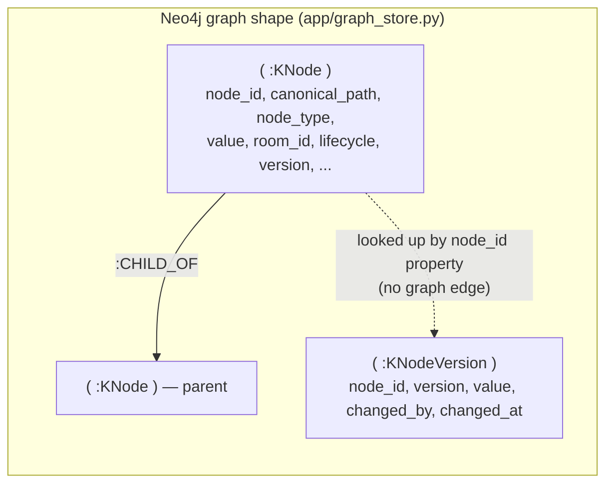
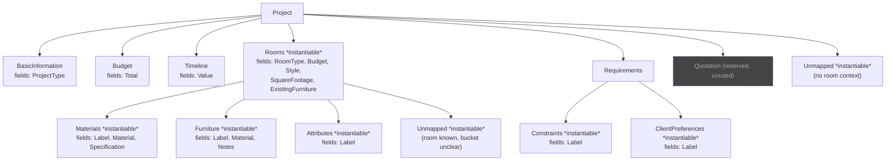
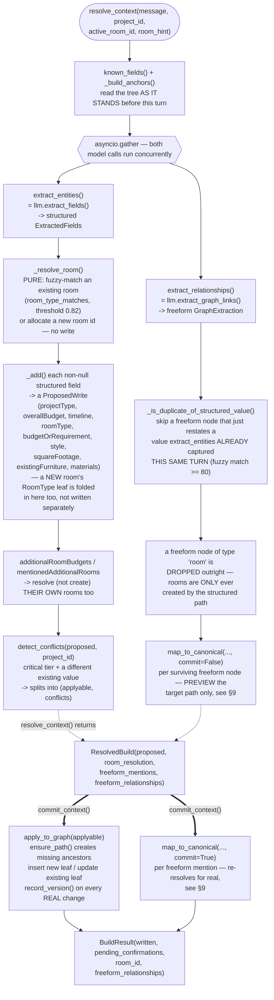
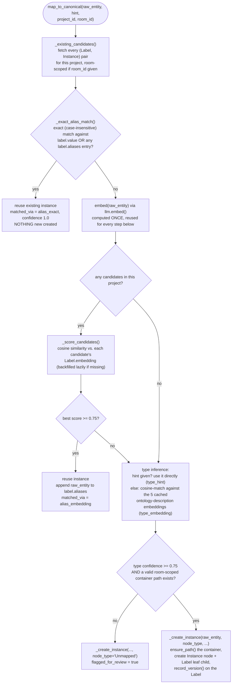
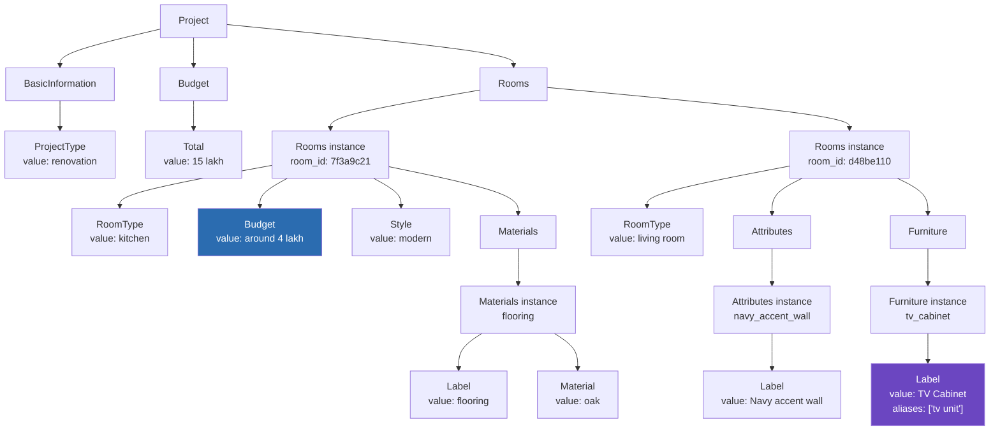

# How Context Gets Built — Nodes, Rooms, and Relations Explained

A deep dive into `app/context_builder.py` and `app/canonical_mapper.py` — the two modules
that turn a chat message into graph nodes — written from direct inspection of the code as it
stands today (uncommitted working tree, 2026-08-12; updated later the same day for the
classifier-redesign work's resolve/commit split — see the classifier-redesign-decisions
memory). Every `canonical_path`, field name, and threshold below is copied from the real
source, not paraphrased.

> **Storage note:** this codebase is mid-migration from **MongoDB** (Beanie `Document`
> classes, one `KnowledgeNode` per Mongo document) to **Neo4j** (`app/graph_store.py`,
> `app/neo4j_db.py`, both currently untracked/uncommitted). `app/models.py`'s `KnowledgeNode`
> docstring already says outright: *"Lives in Neo4j, not Mongo."* Everything in this document
> describes the **current Neo4j shape**. Where it matters, a callout marks what changed from
> the old Mongo-document design.

## Table of contents

1. [What "build context" means](#1-what-build-context-means)
2. [Storage shape: nodes and relationships in Neo4j](#2-storage-shape-nodes-and-relationships-in-neo4j)
3. [The ontology: the shape every node is allowed to take](#3-the-ontology-the-shape-every-node-is-allowed-to-take)
4. [`canonical_path`: the addressing scheme](#4-canonical_path-the-addressing-scheme)
5. [The two node-creation engines](#5-the-two-node-creation-engines)
6. [Step-by-step: `build_context()`](#6-step-by-step-build_context)
7. [Room creation & fuzzy matching](#7-room-creation--fuzzy-matching)
8. [Conflict detection & field tiers](#8-conflict-detection--field-tiers)
9. [The canonical mapper in depth](#9-the-canonical-mapper-in-depth)
10. [What relationships actually exist today](#10-what-relationships-actually-exist-today)
11. [Node lifecycle: active vs. retracted](#11-node-lifecycle-active-vs-retracted)
12. [Full worked example — three turns, one graph](#12-full-worked-example--three-turns-one-graph)
13. [Quirks worth knowing](#13-quirks-worth-knowing)
14. [Quick-reference tables](#14-quick-reference-tables)

---

## 1. What "build context" means

"Build context" is the write path that runs on every turn where the user states or changes a
project fact (an `EDIT_CONTEXT` task). The entry point is `context_builder.build_context()`,
called from `app/graph.py: build_context_node` — itself now just
`resolve_context()` (§6) followed by `commit_context()`, split so a caller (`app/execution.py`'s
write-clustering, for a multi-operation turn) can learn what a message would write before
committing anything. Either way, the same two structurally different jobs happen:

- **Structured extraction** — a small, fixed set of fields (project type, overall budget,
  room type, room budget, style, square footage, existing furniture, materials) that the
  extraction model fills into a strict schema. These are written **directly** to known
  `canonical_path` locations — no ambiguity, no matching needed.
- **Freeform extraction** — anything else the message mentions ("navy accent wall", "TV
  cabinet", "no red tones") that doesn't fit the structured schema. These go through
  `canonical_mapper.map_to_canonical()`, which decides *which* node type they belong to and
  *whether* they're actually a new fact or just a re-mention of one already captured.

Both paths write the same kind of object — a `KnowledgeNode` — into the same Neo4j graph.

---

## 2. Storage shape: nodes and relationships in Neo4j

Every fact, every room, every project — all one Neo4j node label: **`:KNode`**. There is no
separate "Project" node type vs. "Room" node type at the database level; `node_type` is just
a *property* on a generic `:KNode`. Two more labels round out the schema:



- **`:KNode`** — one node per fact/container. Its Python shape is `app.models.KnowledgeNode`
  (see [§14](#14-quick-reference-tables) for the full field list).
- **`:CHILD_OF`** — a *real* Neo4j relationship, not a stored `parent_id` string. Direction is
  **child → parent** (`(n)-[:CHILD_OF]->(p)`, `app/graph_store.py: insert_node`). This is the
  entire containment tree: Project → BasicInformation/Budget/Rooms/Requirements → Room →
  Materials/Furniture/Attributes → individual item instances → their `Label`/`Material`/etc.
  leaves.
- **`:REL`** — one generic relationship type carrying a `relation` property (`derives_from`,
  `uses_material`, …) instead of one Neo4j relationship type per relation value. This is the
  storage the *design* has for non-hierarchical relationships (`app.models.KnowledgeEdge`).
  **As of today, nothing in the live turn ever writes one** — see
  [§10](#10-what-relationships-actually-exist-today).
- **`:KNodeVersion`** — append-only history rows, one per value change. No graph edge back to
  its `:KNode`; every read is `MATCH (v:KNodeVersion {node_id: $node_id})`, since `node_id` is
  an indexed property (`app/neo4j_db.py`'s `kversion_node` index) and a real edge would only
  add a write with no read it speeds up.

A node is **created** with `graph_store.insert_node()`, which runs both the `CREATE (n:KNode)`
and (if `parent_id` is set) the `CREATE (n)-[:CHILD_OF]->(p)` in **one write transaction** — a
node is never left half-attached to the tree. A node is **updated** with `graph_store.save_node()`,
which does a full property overwrite (`SET n = $props`) and never touches `:CHILD_OF` — a
node's parent is fixed at creation and never changes afterward.

---

## 3. The ontology: the shape every node is allowed to take

`ontology/v1.yaml` is the one file that defines every legal `node_type` and where it can live.
Nothing in `canonical_mapper.py` can invent a path outside it (`versioning_policy: additive-only`
— new entries may be added, an existing one is deprecated, never renamed).



Two vocabulary words matter throughout this document:

- **`instantiable: true`** — this node type can exist **zero, one, or many times** at
  runtime, each instance keyed by an opaque id (a room id, or a slugified item name like
  `flooring`). `Rooms`, `Materials`, `Furniture`, `Attributes`, `Constraints`,
  `ClientPreferences`, and `Unmapped` are all instantiable. `BasicInformation`, `Budget`,
  `Timeline`, `Requirements` are singletons — exactly one per project, no instance id.
- **`fields`** — the *leaf* node types a node of this type actually holds values in (e.g.
  `Rooms` doesn't hold a value itself; its `RoomType`/`Budget`/`Style`/… children do).

Only **five** of these instantiable types are ever targets of the freeform canonical mapper:
`Materials`, `Furniture`, `Attributes`, `Constraints`, `ClientPreferences`. `Rooms` and
`Unmapped` are handled by other code paths (room resolution, and the below-confidence
fallback, respectively) — see [§9](#9-the-canonical-mapper-in-depth).

---

## 4. `canonical_path`: the addressing scheme

Every `:KNode` has a `canonical_path` — a dot-joined string that is simultaneously its unique
address, its position in the tree, and (via `ensure_path`) the recipe for which ancestor
containers must exist before it can be written. A few real examples, all producible by the
live code:

| `canonical_path`                                              | `node_type` | Meaning                                            |
| --------------------------------------------------------------- | ----------- | --------------------------------------------------- |
| `Project`                                                        | `Project`   | The project root — created once, lazily            |
| `Project.BasicInformation.ProjectType`                            | `ProjectType` | "renovation" / "new construction" / …             |
| `Project.Budget.Total`                                            | `Total`     | Overall project budget                              |
| `Project.Rooms`                                                   | `Rooms`     | Container for all room instances                    |
| `Project.Rooms.7f3a9c21`                                          | `Rooms`     | One specific room instance (kitchen)                |
| `Project.Rooms.7f3a9c21.RoomType`                                 | `RoomType`  | That room's type, value `"kitchen"`                 |
| `Project.Rooms.7f3a9c21.Materials.flooring.Label`                 | `Label`     | The item's own name, value `"flooring"`             |
| `Project.Rooms.7f3a9c21.Materials.flooring.Material`              | `Material`  | The material chosen, value `"oak"`                  |
| `Project.Rooms.d48be110.Furniture.tv_cabinet.Label`               | `Label`     | A freeform furniture mention, value `"TV Cabinet"`  |
| `Project.Requirements.ClientPreferences.no_red_tones.Label`       | `Label`     | A freeform, non-room-scoped preference              |

Room ids (`7f3a9c21`) and item slugs (`flooring`, `tv_cabinet`) are the two kinds of "opaque
instance id" segments this system ever mints — see `_resolve_room` (room ids,
`uuid4().hex[:8]`) and `canonical_mapper.slugify()` (item slugs, lower-cased/underscored,
falling back to the literal string `"item"` if slugifying leaves nothing).

---

## 5. The two node-creation engines

### 5.1 `context_builder.py` — structured fields

Owns the fixed vocabulary: `projectType`, `overallBudget`, `timeline`, `roomType`,
`budgetOrRequirement`, `style`, `squareFootage`, `existingFurniture`, `materials`. These come
from `llm.extract_fields()`'s strict Pydantic schema (`ExtractedFields`) — there is no
ambiguity about *where* a value goes, only *whether* it conflicts with something already
there (see [§8](#8-conflict-detection--field-tiers)).

### 5.2 `canonical_mapper.py` — freeform facts

Owns everything else: `llm.extract_graph_links()` (a second, independent model call
run **concurrently** with `extract_fields`) proposes freeform "nodes" like `{label: "Navy
accent wall", type: "attribute"}`. `map_to_canonical()` resolves each one to exactly one of
the five freeform ontology types, and decides whether it's the same entity as something
already captured (reuse) or genuinely new (create).

Both engines share two helpers:

- **`ensure_path(canonical_path, project_id)`** (`canonical_mapper.py`, but used by both
  modules) — get-or-create every ancestor container along a path, in order, returning the
  deepest one. This is how `Project`, `Project.Rooms`, and a specific room instance all come
  into existence the first time anything underneath them is written — nobody explicitly
  creates `Project` or `Project.Rooms`; they're a side effect of the first real write.
- **`versioning.record_version(node, changed_by=...)`** — appends one `:KNodeVersion` row
  every time a node's value is actually set (create or real change), called from both
  `apply_to_graph` (structured) and `_create_instance` (freeform).

---

## 6. Step-by-step: `build_context()`

`build_context()` is `resolve_context()` (read-mostly — the only writes are idempotent
container scaffolding via `ensure_path`, never a field value) followed by `commit_context()`
(the actual field-value writes). The diagram below shows the whole thing; the dashed line
marks the boundary between the two.



Walking each stage against the real functions (`app/context_builder.py`):

1. **`known_fields(project_id, active_room_id)`** — reads every *active* node in the project,
   projects it into a flat dict (`{"projectType": ..., "roomType": ..., ...}`) so the
   extraction model's prompt can say "here's what we already know, only extract what's NEW."
2. **`_build_anchors(project_id)`** — builds `{id, label, type}` dicts (`"project"`,
   `"budget:total"`, `"room:<id>"`, `"budget:<room_id>"`) so the freeform extractor can
   *reference* existing entities by id rather than re-describing them. Anchors reflect the
   tree **before this turn's own writes** — a room this turn resolved to be new (via
   `_resolve_room` below) isn't a real node yet and so isn't visible to this turn's own
   freeform extraction call either way.
3. **`extract_entities` + `extract_relationships` run concurrently** via `asyncio.gather` — if
   either model call throws, that half is skipped (logged, not fatal) and the other half's
   result still applies.
4. **`_resolve_room(project_id, extracted.roomType or room_hint, active_room_id)`** — see
   [§7](#7-room-creation--fuzzy-matching). Pure now: returns a `RoomResolution(room_id,
   new_room_type)`, never writes. `room_hint` (and `active_room_id` itself, for a multi-op
   task) is no longer auto-detected by regex — as of the classifier-connection plan, both are
   derived by the *caller* (`app/execution.py`'s `_resolve_write_task`, or `app/graph.py`'s
   `build_context_node` re-resolve fallback) from `classify_operations`' own project-grounded
   `Operation.connection` via `canonical_mapper.split_connection`; `resolve_context()` itself
   just receives whatever value lands in its `room_hint` parameter, same as always.
5. Every non-null structured field becomes a `ProposedWrite` via the inner `_add()` closure,
   which also tags it with a **tier** (`FIELD_TIERS.get(field_name, "moderate")`) and, if the
   value is a string, appends it to `structured_values` (used by the freeform dedup check
   later). A new room's `RoomType` leaf (`room_resolution.new_room_type`) is added to this
   same `proposed` list, not written immediately.
6. **`additionalRoomBudgets`** (a figure for a *second* room mentioned in the same message)
   and **`mentionedAdditionalRooms`** (room names mentioned with no figure yet) each resolve
   their *own* room via the same pure `_resolve_room` path — a single message can still touch
   more than one room.
7. **`detect_conflicts`** splits the proposed writes into `applyable` (write it) and
   `conflicts` (hold it back, ask the user) — see [§8](#8-conflict-detection--field-tiers).
   This is where `resolve_context()` ends, packaging everything computed so far into a
   `ResolvedBuild`.
8. **`commit_context()`** calls `apply_to_graph(applyable)`, which actually creates/updates
   each leaf (and, transitively via `ensure_path`, any missing ancestor container) and returns
   the list of paths that **really changed** — see [§13](#13-quirks-worth-knowing) for what
   "really changed" excludes.
9. `commit_context()` then calls `map_to_canonical()` — this time with `commit=True` — for
   every freeform mention `resolve_context()` previewed, dedup'd against `structured_values`
   and with any `type: "room"` proposal already dropped. Each call **re-resolves for real**
   rather than trusting its own earlier preview verbatim (project state can have changed
   since — see [§9](#9-the-canonical-mapper-in-depth)); one freeform mention, one Neo4j write
   (instance + `Label` leaf).

---

## 7. Room creation & fuzzy matching

`_resolve_room(project_id, room_type, active_room_id)` (`app/context_builder.py`) is now a
**pure lookup** — it used to write a new room's `RoomType` leaf itself; it doesn't anymore:

```python
if room_type:
    for room_id, existing_type in (await _existing_rooms(project_id)).items():
        if room_type_matches(existing_type, room_type):
            return RoomResolution(room_id=room_id)
    return RoomResolution(room_id=uuid4().hex[:8], new_room_type=room_type)
return RoomResolution(room_id=active_room_id)
```

- **`room_type_matches`** (`app/models.py:108`) is a `SequenceMatcher` ratio with threshold
  `0.82` — a typo like `"bedrroom"` still matches an existing `"bedroom"` room (no duplicate
  created), while `"kitchen"` vs `"bedroom"` never do (two real rooms). This exact function is
  reused by `context_builder` and shared with the deletion path's own room matching in
  `app/graph.py`, so "is this the same room" means the same thing everywhere.
- A genuinely new room's id is **allocated but not written** here — `RoomResolution.new_room_type`
  tells the caller (`resolve_context()`) to fold a `RoomType` `ProposedWrite` into the SAME
  batch every other structured field goes through, rather than a separate write round-trip.
  This is what makes room resolution safe to call from a read-only resolve phase: the room
  (and its ancestor containers `Project`/`Project.Rooms`) doesn't exist in Neo4j until
  `commit_context()` actually runs `apply_to_graph`.
- The main body also adds a `roomType` write for the same value when `extracted.roomType` is
  set (see the pipeline diagram's `AddFields` step) — so a genuinely new room can end up with
  TWO `ProposedWrite`s for the identical `RoomType` path in one `proposed` list.
  `detect_conflicts` sees both as `existing is None` (nothing committed yet) and lets both
  through as `applyable`; `apply_to_graph` processes them in order, so the second one finds
  `existing.value == write.value` (from the first one it just wrote) and treats it as a **true
  no-op** (no version bump, not counted in `written`). Same end state as before the resolve/
  commit split — no duplicate, no wasted history row — just reconciled inside one
  `apply_to_graph` pass instead of across two separate ones.
- If room-scoped fields are extracted (`style`, `budgetOrRequirement`, `materials`, …) but the
  message named **no** room and there's no `active_room_id` to fall back to (e.g. "make it
  modern" as literally the first message of a session), `resolve_context` mints an
  **unlabeled room id** on the spot (`uuid4().hex[:8]`, no `RoomType` value at all) so the
  facts have somewhere to attach rather than being silently dropped. Its container is created
  lazily the moment the first field under it is actually written.
- `app/execution.py`'s write-clustering relies on `_resolve_room` being pure: when two
  operations in one turn both resolve against the same not-yet-existing room, they're
  clustered together (by a shared `new-room:<slug>` key) and committed sequentially — the
  second one re-resolves fresh, by which point the first one's commit has made the room a real,
  fuzzy-matchable node, so it reuses it instead of allocating a second id and creating a
  duplicate room. See `SYSTEM_FLOW.md`'s `handle_split_intents_node` entry.

---

## 8. Conflict detection & field tiers

`app/models.py: FIELD_TIERS` assigns every structured field name one of three tiers, which
drives two independent policies:

| Field                                                              | Tier       | Conflict → held for confirmation? | Decline retry budget |
| -------------------------------------------------------------------- | ---------- | ----------------------------------- | ----------------------- |
| `projectType`, `overallBudget`, `roomType`, `budgetOrRequirement`, `moreRoomsPending` | `critical` | **yes**                             | 3 rephrases (4 asks total) |
| `style`, `squareFootage`, `timeline`                                  | `moderate` | no — applies automatically          | 1 rephrase (2 asks total)  |
| `existingFurniture`, `materials`                                      | `optional` | no                                   | 0 (asked once, never rephrased) |

`detect_conflicts(proposed, project_id)` (`app/context_builder.py:257`) is the entire policy in
one loop:

```python
existing = await graph_store.find_one(project_id, write.canonical_path)
if existing is None or existing.value is None or existing.value == write.value:
    applyable.append(write)          # nothing to fight over
elif write.tier == "critical":
    conflicts.append(Conflict(...))  # hold it back, ask the user
else:
    applyable.append(write)          # moderate/optional: just overwrite it
```

**Example.** Turn 1 says the kitchen budget is "4 lakh" → `Project.Rooms.<id>.Budget = "4
lakh"` is written outright (nothing existed there before). Turn 5 says "actually make the
kitchen budget 6 lakh" → `budgetOrRequirement` is `critical`, and a different, non-null value
already exists → this becomes a `Conflict`, not an immediate write. `build_context_node`
(`app/graph.py:257`) sees `BuildResult.pending_confirmations` non-empty, asks
`llm.generate_conflict_confirmation()` to phrase a yes/no question, and stores the
pending change in `GraphState["pending_confirmation"]` — **nothing in the graph changes**
until `confirm_conflict_node` sees an affirmative reply on a later turn, at which point it
calls `apply_to_graph` directly with the held-back value.

By contrast, if turn 5 instead says "actually make it more industrial" (`style`, `moderate`),
the new value **overwrites the old one immediately** — no confirmation loop for a low-stakes
field.

---

## 9. The canonical mapper in depth



**Every freeform fact becomes exactly two `:KNode`s**, created together in
`_create_instance()` (`app/canonical_mapper.py:259`):

1. The **instance** node itself — `node_type` is one of `Materials` / `Furniture` /
   `Attributes` / `Constraints` / `ClientPreferences` / `Unmapped`. Its `value` is **always
   `None`** — it's a container, not a fact.
2. Its **`Label`** child — `node_type="Label"`, `value=raw_entity` (the actual text), plus the
   `embedding` vector so a *future* mention can be scored against it without re-embedding.

```python
instance = KnowledgeNode(canonical_path=instance_path, node_type=node_type,
                          parent_id=container.node_id, room_id=room_id, confidence=confidence)
label = KnowledgeNode(canonical_path=f"{instance_path}.Label", node_type="Label",
                       parent_id=instance.node_id, value=raw_entity, embedding=embedding)
```

`map_to_canonical()` also takes `commit: bool = True`. Everything above the two branches
(`Exact`, `Score`/`BestScore`, `TypeInfer`) is unaffected — reusing an already-resolved
instance isn't a pending write, so it's returned the same way regardless of `commit`. Only the
two creation branches (`Unmapped`, `CreateNew`) change: `commit=False` computes the exact same
collision-safe target path (via a shared `_resolve_instance_path` helper — the same slug logic
`_create_instance` itself uses) and returns it as a **preview** (`node_id=""`, nothing written)
instead of calling `_create_instance`. `context_builder.resolve_context()` uses this to learn a
freeform mention's target path before any turn's writes commit; `commit_context()` then calls
`map_to_canonical()` again with `commit=True` to actually create it — a fresh, real lookup, not
a blind commit of the earlier preview, since project state can have changed in between (see
§6, step 9, and `app/execution.py`'s write-clustering in `SYSTEM_FLOW.md`).

### Worked examples

- **Reuse via exact alias.** Project already has `Project.Rooms.<id>.Furniture.tv_cabinet`
  with `Label.value = "TV Cabinet"`. User later says "I like the **TV Cabinet** in oak" — the
  lowercased text matches exactly → the *existing* instance is reused, confidence `1.0`,
  **nothing new is created**.
- **Reuse via embedding (a real synonym).** User says "let's do a **TV unit** instead of
  built-ins" — `"tv unit"` doesn't exact-match `"TV Cabinet"`, but its embedding scores `0.83`
  cosine similarity against the existing Label's embedding (≥ `0.75`) → same instance reused,
  and `"tv unit"` is appended to that Label's `aliases` list (not a new node — a new entry in
  an existing property).
- **Genuinely new, type inferred.** User says "no red tones anywhere" with no type hint from
  the extractor. `map_to_canonical` embeds the text, finds no room-scoped candidate close
  enough, then cosine-scores it against the five ontology **type descriptions** (cached
  module-wide, embedded once for the process's whole lifetime — see
  `_get_type_description_vectors`). Best match: `ClientPreferences`
  (*"a stylistic or qualitative preference"*) at `0.79` → creates
  `Project.Requirements.ClientPreferences.no_red_tones` + its `Label` child.
- **Below confidence → `Unmapped`.** A vague utterance ("that thing near the window") scores
  below `0.75` against every ontology type → routed to
  `Project.Rooms.<id>.Unmapped.<slug>` (or `Project.Unmapped.<slug>` with no room context) with
  `flagged_for_review=True` — held for human review, not a permanent classification.
- **Slug collision.** Two *different* entities both slugify to `cabinet` (e.g. two separate
  cabinet mentions that map to different instances because they scored below the reuse
  threshold against each other) — `_create_instance` detects the path collision and
  disambiguates with a random suffix: `...Furniture.cabinet_a91f3c`.

### Deletion uses the same candidate pool, stricter

`resolve_deletion_target()` is a **separate, read-only** entry point used by
`delete_context_node` (not `build_context` — deletion is a different graph node entirely). It
shares `_existing_candidates`, restricted to `lifecycle="active"` nodes, but with a **stricter**
match threshold (`0.85` vs. `0.75` for creation) and an explicit ambiguity check — two
candidates within `0.05` cosine similarity of each other return `"ambiguous"` rather than
guessing which one to retract. It never creates anything, even as a side effect, beyond
lazily backfilling a missing embedding on an *existing* candidate it had to score.

---

## 10. What relationships actually exist today

This is worth stating precisely, because the ontology and the extraction schema both *talk
about* relationships that the storage layer doesn't yet persist:

| Relationship                                                        | Persisted in Neo4j today?                                                                 |
| --------------------------------------------------------------------- | --------------------------------------------------------------------------------------------- |
| **Containment** (`Project` → `Rooms` → room instance → `Materials` → item → `Label`) | ✅ **Yes** — every `:CHILD_OF` edge, created atomically with the node itself                   |
| **`aliases`** (an alternate name for the same entity)                  | ✅ Yes, but as a **property** (`list[str]` on the `Label` node), not a graph edge              |
| **Cross-cutting relations** (`uses_material`, `derives_from`, `budget_for`, …) — modeled as `app.models.KnowledgeEdge`, stored via the generic `:REL` relationship | ❌ **No.** `graph_store.insert_edge()` exists and is fully implemented, but no live call site calls it. |
| **Freeform relationships extracted by the model** (`extract_graph_links`'s `new_edges`) | ❌ **No.** Surfaced on `BuildResult.freeform_relationships` for observability/testing, then discarded — `build_context_node` in `app/graph.py` never reads that field. |
| **Revisions / retractions the freeform model proposes** (`revised_nodes`, `retracted_node_ids`) | ❌ **No.** `KnowledgeNode` has no active/superseded/retracted-via-revision lifecycle yet; a logged warning is the only effect. |

So: **the only relationship a chat turn can actually create in the graph is `:CHILD_OF`** —
the containment tree. Everything else in `ontology/PHASE9_DEPENDENCY_GRAPH.md`'s design
(dependency edges, revision chains) is schema-ready but not yet wired to a live write path.

---

## 11. Node lifecycle: active vs. retracted

Every `:KNode` carries `lifecycle: "active" | "retracted"` (default `"active"`). This is
**separate** from `status: "confirmed" | "assumed"` (which tracks *provenance* — did the user
say it, or did the system infer it — not whether it still holds).

- Nothing in `build_context`/`canonical_mapper` ever retracts a node — retraction is
  `versioning.retract_node()` / `retract_subtree()`, called only from `delete_context_node`
  and `confirm_conflict_node`'s delete branches.
- It matters here because **every candidate-matching query filters on it**:
  `canonical_mapper._existing_candidates` (creation/reuse matching, `active_only=False` by
  default — a retracted node's Label is still checked so a re-stated entity isn't confused
  with one that was deliberately removed) and `resolve_deletion_target` (`active_only=True` —
  you can't "delete" something already gone).
- `known_fields`, `find_knowledge_gap`, and `materialize_project_summary` all read only
  `lifecycle="active"` nodes — a retracted node's last real value stays in the graph (and its
  full version history) for audit purposes, it just stops being "known."

---

## 12. Full worked example — three turns, one graph

**Turn 1** — *"We're renovating our kitchen. Overall budget is 15 lakh, kitchen budget around
4 lakh, going for a modern look, and oak flooring."*

`extract_fields` returns `projectType="renovation"`, `overallBudget="15 lakh"`,
`roomType="kitchen"`, `budgetOrRequirement="around 4 lakh"`, `style="modern"`,
`materials=[{item:"flooring", material:"oak"}]`. No existing rooms, so `_resolve_room` mints
`room_id = "7f3a9c21"` and writes its `RoomType` immediately. Everything else applies with no
conflicts (nothing existed before). The freeform extractor's own "modern style" proposal (if
any) gets dropped by `_is_duplicate_of_structured_value` — `style="modern"` was already
captured structurally this same turn.

**Turn 2** — *"Let's also do a living room — navy accent wall, and I want a nice TV cabinet.
Not sure on budget yet."*

`extract_fields` returns only `roomType="living room"` (no figure, so `budgetOrRequirement` is
null — this room's `Budget` leaf simply never gets written; `find_knowledge_gap` will later ask
for it). `_resolve_room` doesn't fuzzy-match `"living room"` against the existing `"kitchen"`
room (score well under `0.82`) → mints a **second** room, `room_id = "d48be110"`.

`extract_graph_links` proposes two freeform nodes: `{label:"Navy accent wall", type:"attribute"}`
and `{label:"TV Cabinet", type:"entity"}`. Neither duplicates a structured value this turn
(only `"living room"` was captured structurally). Both go through `map_to_canonical`,
room-scoped to `d48be110`:

- "Navy accent wall" → type-inferred as `Attributes` (`0.81` confidence) →
  `Project.Rooms.d48be110.Attributes.navy_accent_wall` + `Label` child.
- "TV Cabinet" → type-inferred as `Furniture` (`0.83` confidence) →
  `Project.Rooms.d48be110.Furniture.tv_cabinet` + `Label` child.

**Turn 3** — *"Actually, let's do a TV unit instead, in a matte black finish."*

`"TV unit"` doesn't exact-match `"TV Cabinet"`, but embeds to `0.83` cosine similarity against
it (≥ `0.75`) → **same instance reused**, `"tv unit"` appended to that Label's `aliases`. No
new `Furniture` node is created for this mention.

The resulting graph (containment only — the one relationship type that's actually persisted):



(Arrows drawn parent → child here for readability; the actual `:CHILD_OF` edges in Neo4j point
the other way, child → parent, per `graph_store.insert_node`.) Note the Living Room has **no**
`Budget` leaf at all — turn 2 never stated one, and nothing creates a placeholder; the question
engine will surface that gap on a later turn instead.

---

## 13. Quirks worth knowing

A few behaviors that are non-obvious from reading either module in isolation, but matter if
you're inspecting raw graph data or debugging why a turn's confirmation message looks thin:

- **`ensure_path`'s ancestor-typing fallback is broader than its own docstring suggests.**
  The rule is: a path segment matching a real `ontology/v1.yaml` key gets that key as its
  `node_type`; *any other* segment gets `node_type="Rooms"` as a generic placeholder. The
  docstring frames this as "a room instance id" specifically, but the code applies it to
  **any** non-ontology segment — including a material item slug like `flooring`. So the
  *container* node at `Project.Rooms.<id>.Materials.flooring` (the parent of that item's
  `Label`/`Material`/`Specification` leaves) is stored with `node_type="Rooms"`, not
  `"Materials"`. Nothing in the current codebase queries a container by that node_type, so
  it's harmless in practice — but don't be surprised if you inspect the graph directly and see
  it.
- **A freeform fact's `written` entry is its instance path, not its value-holding leaf.**
  `build_context` appends `match.canonical_path` (the *instance* node, e.g.
  `...Furniture.tv_cabinet`) to `written` — not `...Furniture.tv_cabinet.Label`, which is
  where the actual text lives. The instance node's own `value` is always `None`.
  `_summarize_written` (`app/graph.py:220`) then does `if node.value is None: continue` for
  every path in `written` — so **every freeform fact created this turn is silently absent
  from the "Got it — noted ..." confirmation message**, not even counted as "N other details
  noted." The node is created correctly; the turn's own acknowledgment of it just never
  mentions it.
- **A restated value is a true no-op, all the way down.** `apply_to_graph` only calls
  `record_version` when a value is new or actually changes. A same-turn restatement of an
  already-known fact (which the extraction model doesn't always avoid, despite being told
  "only extract what's new") produces no version row, no `updated_at` bump, and doesn't
  appear in `written` — it doesn't pad out the confirmation message or the audit history.
- **Freeform `"room"` proposals are always dropped.** If `extract_graph_links` proposes a new
  node with `type: "room"`, `build_context` skips it outright — rooms can **only** be created
  via `_resolve_room` (structured `roomType`/`additionalRoomBudgets`/`mentionedAdditionalRooms`),
  never via `canonical_mapper`. This keeps room creation as a single, fuzzy-matched code path
  instead of two independent ones that could disagree.
- **Freeform anchors reflect the tree at the *start* of the turn.** `_build_anchors` runs
  before `_resolve_room` might create a brand-new room this same turn — so a freeform mention
  in the same message that logically belongs to that new room still gets written under it
  correctly (the `room_id` variable is updated), but the *anchor list* shown to the freeform
  extraction model's own prompt won't include that room as a reference-able id yet.

---

## 14. Quick-reference tables

**`KnowledgeNode` fields** (`app/models.py:180`) — the complete shape of every `:KNode`:

| Field              | Type                              | Notes                                                                 |
| -------------------- | ------------------------------------ | ------------------------------------------------------------------------ |
| `node_id`             | `str` (hex)                          | The business key — what `:CHILD_OF`/`:REL`/`:KNodeVersion` reference     |
| `canonical_path`      | `str`                                 | Unique address, see §4                                                    |
| `parent_id`           | `Optional[str]`                       | Derived from the `:CHILD_OF` edge on read, not a stored property         |
| `node_type`           | `str`                                 | Matches an `ontology/v1.yaml` key, or `"Rooms"`/`"Label"` for instances  |
| `value`               | `Optional[Any]`                       | `None` for every container/instance node; set only on true leaves        |
| `aliases`              | `list[str]`                           | Alternate names accepted via embedding-match reuse; `Label` nodes only    |
| `confidence`           | `float`                               | From canonical-mapper type inference; `1.0` for structured writes         |
| `status`               | `"confirmed" \| "assumed"`            | Provenance — did the user state it, or was it inferred                    |
| `lifecycle`            | `"active" \| "retracted"`             | See §11                                                                    |
| `changed_by`           | `"user_message" \| "inferred" \| "system_default"` | Only `"user_message"` is actually produced by any code path today |
| `room_id`              | `Optional[str]`                       | Set for anything scoped under a specific room                            |
| `embedding`            | `Optional[list[float]]`               | `Label` nodes only, 4096-dim, lazily backfilled if missing                |
| `version`              | `int`                                 | Bumped on every real value change; mirrored into `:KNodeVersion`         |

**Which function creates which node type:**

| Function                                   | Creates                                                              |
| --------------------------------------------- | ------------------------------------------------------------------------ |
| `canonical_mapper.ensure_path`                | Ancestor containers of any kind, lazily, as a side effect of any write   |
| `context_builder._resolve_room`               | **Nothing** — pure lookup, returns `RoomResolution(room_id, new_room_type)`; the RoomType leaf for a new room is created by `apply_to_graph` below, via the same `ProposedWrite` batch |
| `context_builder.apply_to_graph`               | Structured leaves: `ProjectType`, `Total`, `Value`, `RoomType` (including a new room's), `Budget`, `Style`, `SquareFootage`, `ExistingFurniture`, `Label`/`Material`/`Specification` (materials) |
| `canonical_mapper._create_instance`            | A freeform instance (`Materials`/`Furniture`/`Attributes`/`Constraints`/`ClientPreferences`/`Unmapped`) + its `Label` child |
| `versioning.record_version`                    | `:KNodeVersion` rows only — never a `:KNode`                              |

**Thresholds cheat sheet:**

| Constant                              | Value  | Used for                                                         |
| ---------------------------------------- | -------- | -------------------------------------------------------------------- |
| `_ROOM_TYPE_FUZZY_MATCH_THRESHOLD` (`app/models.py`) | `0.82` | Is this the same room (creation and deletion both)                |
| `canonical_mapper._MATCH_THRESHOLD`      | `0.75` | Alias reuse AND type-inference confidence for freeform creation    |
| `canonical_mapper._DELETION_MATCH_THRESHOLD` | `0.85` | Stricter bar for matching a deletion target — a wrong delete can't be undone |
| `canonical_mapper._DELETION_AMBIGUITY_MARGIN` | `0.05` | Two candidates this close together → ask, don't guess              |
| `context_builder._DEDUP_SCORE_THRESHOLD` | `80` (0–100 scale) | Freeform label vs. a same-turn structured value → treat as duplicate |
