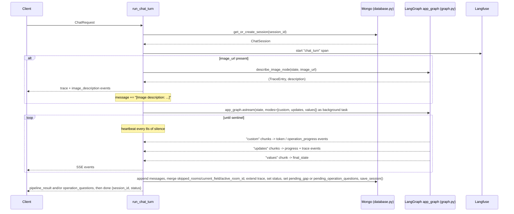
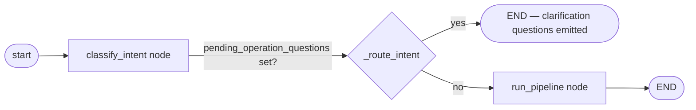
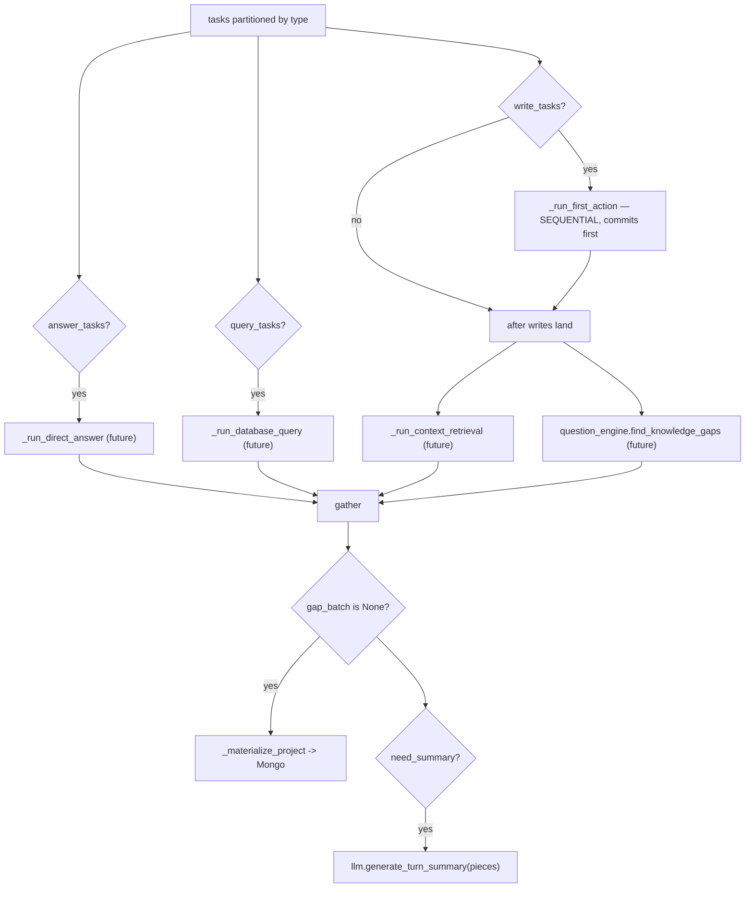
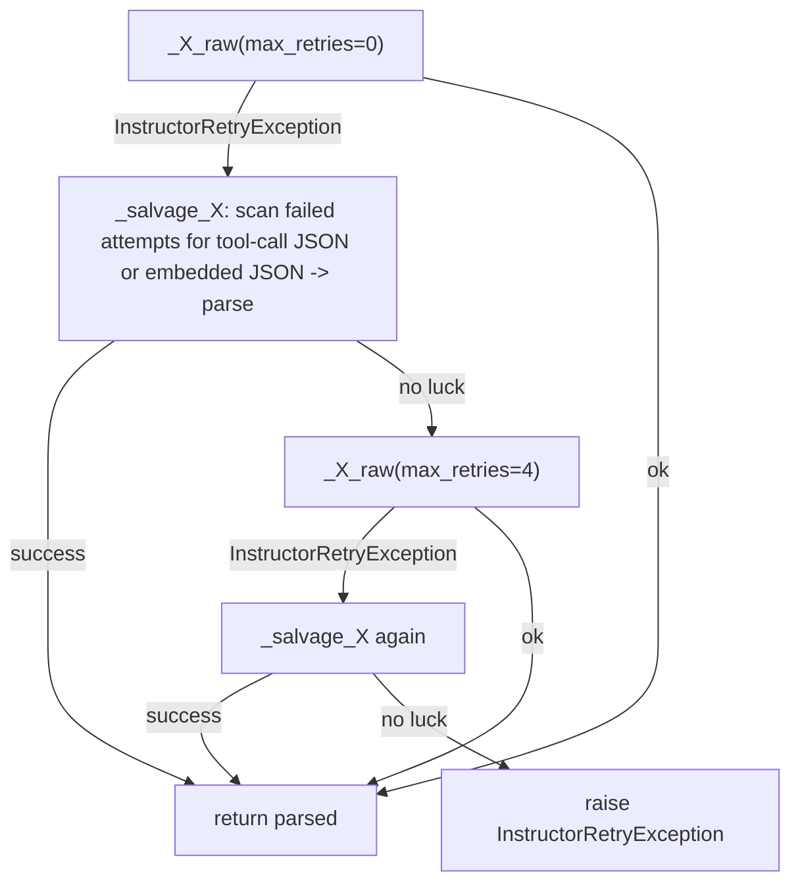
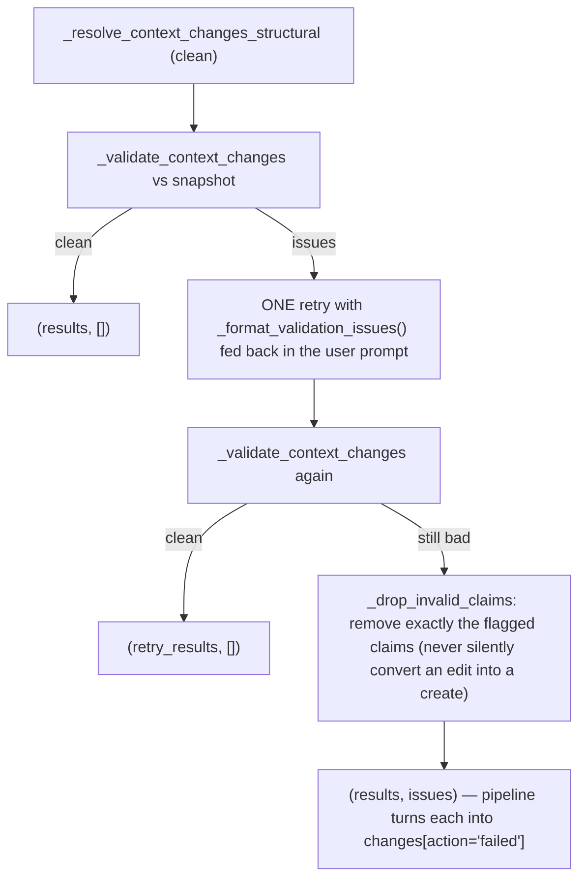
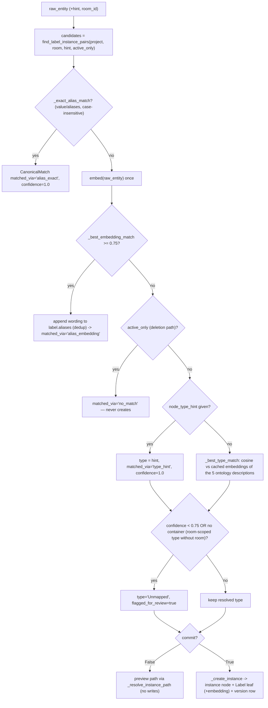
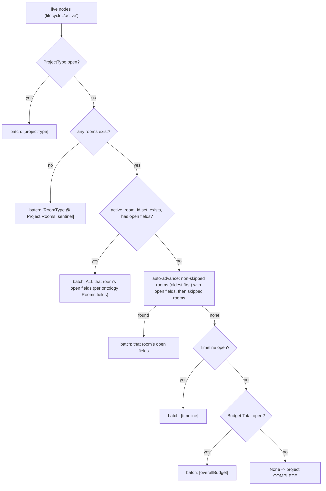

# Module Detailed Flow — Interior Design Chat

Companion document: **[SYSTEM_FLOW_OVERVIEW.md](SYSTEM_FLOW_OVERVIEW.md)** — the whole-system turn
flow at the stage level. **This file goes one level deeper: every module, its functions (with
signatures), what goes in, what comes out, and the internal decision flows**, with files and
functions named exactly as they appear in the code.

Scope: everything under `app/`, plus `ontology/v1.yaml`. `scripts/`, `test.py`, and `app/test.py`
are scratch/dev scripts and are not part of the running system.

---

## 0. Module inventory

| File | Role in one line | Wired into the live turn? |
|---|---|---|
| `app/main.py` | FastAPI app, lifespan (Mongo+Neo4j connect), router mounting | Yes |
| `app/chat.py` | `POST /chat` SSE endpoint + per-turn event generator | Yes |
| `app/routes.py` | Read-only debug/viewer endpoints | Yes |
| `app/graph.py` | LangGraph `StateGraph`: `classify_intent` → `run_pipeline` | Yes |
| `app/pipeline.py` | Single per-turn orchestrator (writes, retrieval, query, answer, gaps, summary, completion) | Yes |
| `app/understanding.py` | Pure message → `Meaning` (tasks) layer | Yes (via graph) |
| `app/tasks.py` | `TaskType` / `TaskSpec` vocabulary | Yes |
| `app/llm.py` | Every LLM/embed/vision call + structured-output schemas + retry/salvage/validation | Yes |
| `app/prompts.py` | All prompt text/templates | Yes (via llm) |
| `app/context_builder.py` | Tree read/write primitives (`apply_to_graph`, `render_project_tree_text`, summaries) | Yes |
| `app/canonical_mapper.py` | Freeform-mention → canonical node resolution (alias/embedding dedup) | Yes (via pipeline) |
| `app/question_engine.py` | Knowledge-gap detection (what's still open) | Yes (via pipeline) |
| `app/retrieval.py` | Scoped subtree loading | Partially — pipeline uses `load_subtree` only |
| `app/rag.py` | Catalog vector search | Yes (via pipeline) |
| `app/versioning.py` | Append-only value history + soft deletion | Yes |
| `app/graph_store.py` | Neo4j CRUD layer (the only module that speaks Cypher) | Yes |
| `app/neo4j_db.py` | Neo4j driver + constraints | Yes |
| `app/database.py` | Mongo connection, Beanie init, session helpers, indexes | Yes |
| `app/models.py` | All Pydantic/Beanie models | Yes |
| `app/config.py` | Settings (env), model-role routing | Yes |
| `app/observability.py` | Langfuse singleton | Yes (import side-effect) |
| `app/inference.py` | LLM fill-in of a field, `changed_by="inferred"` | Read side only (`list_inferred`) |
| `app/calculation.py` | Deterministic computed values, `changed_by="system_default"` | Read side only (`list_calculated`) |
| `app/facts.py` | Read-side: values stated by the client | No |
| `app/dependency_graph.py` | `derives_from` edges + recompute cascade | No |
| `app/graph_reasoning.py` | Precomputed graph questions (budget overage, material usage) | No |
| `ontology/v1.yaml` | The canonical schema the tree is built from | Yes (data, loaded by canonical_mapper) |

---

## 1. `app/main.py` — application entry

```python
lifespan(app: FastAPI) -> async generator
```

**Flow:** startup → `database.connect_to_mongo()` → `neo4j_db.connect_to_neo4j()` → serve →
shutdown → `close_mongo_connection()` → `close_neo4j_connection()` → `langfuse.get_client().flush()`.

| Element | Input | Output |
|---|---|---|
| `GET /health` | — | `{"status": "ok"}` |
| `GET /viewer` | — | `app/static/viewer.html` (debug UI) |
| routers | — | `app.chat.router`, `app.routes.router` |
| `/static` | — | StaticFiles mount |

---

## 2. `app/chat.py` — transport + per-turn event loop

### 2.1 Request model

```python
class ChatRequest(BaseModel):
    session_id: Optional[str]                       # None -> new session
    message: str
    image_url: Optional[str]
    operation_answers: Optional[dict[str, str]]     # resume: {op_id: chosen_value}
    operation_room_selections: Optional[dict[str, list[str]]]  # resume: bundled multi-room picks
```

### 2.2 The endpoint

```python
@router.post("/chat")
async def chat(req: ChatRequest) -> StreamingResponse   # media_type="text/event-stream"
```
Each event dict from `run_chat_turn()` becomes `data: {"type": ..., ...}\n\n`; `heartbeat` events
become `: keep-alive\n\n` comment lines.

### 2.3 The turn generator

```python
async def run_chat_turn(
    session_id: Optional[str],
    message: str,
    image_url: Optional[str] = None,
    operation_answers: Optional[dict[str, str]] = None,
    operation_room_selections: Optional[dict[str, list[str]]] = None,
) -> AsyncIterator[dict]
```

**Inner flow:**



**Inputs:** the five `ChatRequest` fields.
**Outputs (event dicts):** `image_description`, `token`, `progress`, `trace`, `operation_progress`,
`pipeline_result`, `operation_questions`, `error`, `done`, `heartbeat` (exact payloads in
SYSTEM_FLOW_OVERVIEW.md §6).

**Persistence decisions at turn end** (the `elif` ladder):

| Condition | What is stored |
|---|---|
| `pending_operation_questions` set and still `in_progress` | each question appended to messages; `session.pending_operation_questions = {...}`; `pending_gap = None` |
| `is_question` and still `in_progress` | `session.pending_gap = final_state["pending_gap"]`; `pending_operation_questions = None` |
| otherwise (incl. complete) | both cleared |

Also notable: on a resume turn (`message == ""`), the persisted user bubble falls back to
`", ".join(operation_answers.values())` so the transcript isn't blank.

---

## 3. `app/routes.py` — read-only endpoints

| Function | Signature | Input | Output |
|---|---|---|---|
| `list_sessions` | `(limit: int = 20)` | query param | `[{session_id, status, updated_at, message_count}]` newest-first |
| `list_projects` | `(limit: int = 20)` | query param | `list[ProjectContext]` (completion snapshots) |
| `get_session_state` | `(session_id: str)` | path param | full session state + live `knowledge_nodes` (all nodes for the project) + `trace` + `messages`; 404 if unknown |

---

## 4. `app/graph.py` — the LangGraph layer

### 4.1 Graph structure

```python
app_graph = build_graph()   # StateGraph(GraphState)

# entry: classify_intent
# classify_intent --_route_intent()--> run_pipeline        (normal)
#                 \_route_intent()--> END                  (pending_operation_questions set)
# run_pipeline -> END
```



### 4.2 `GraphState` (TypedDict) — the turn's shared data

| Key | Type | Written by / meaning |
|---|---|---|
| `session_id`, `project_id` | str | chat.py |
| `message`, `history` | str | chat.py (message may carry the image description) |
| `skipped_rooms` | list[str] | classify_intent (decline detection) |
| `current_field` | Optional[dict] | carried from session (`{"canonical_paths", "room_id"}`) |
| `active_room_id` | Optional[str] | classify_intent guess, corrected by pipeline for brand-new rooms |
| `intent` | list[str] | classify_intent (telemetry) |
| `tasks` | list[TaskSpec] | classify_intent |
| `pending_operation_questions` | Optional[dict] | classify_intent when holding a turn; chat.py on input (resume) |
| `operation_answers`, `operation_room_selections` | Optional[...] | client only |
| `pending_gap` | Optional[dict] | pipeline (serialized `KnowledgeGapBatch`) |
| `answer` | str | pipeline (DIRECT_ANSWER stream, joined) |
| `database_summary`, `context_summary`, `changes_summary` | Optional[str] | pipeline (turn summary) |
| `next_message`, `is_question` | Optional[str], bool | pipeline |
| `complete` | bool | pipeline |
| `trace` | list[TraceEntry] | every node (reducer: `operator.add`) |

### 4.3 `classify_intent_node(state) -> dict`

| Step | What happens |
|---|---|
| decline detection | if `_is_decline(message)` and `current_field.room_id` set → append room to `skipped_rooms` |
| resume? | `pending_operation_questions` present → rebuild `TaskSpec`s, `_apply_operation_answers()` merges answers; **no LLM call** |
| fresh | `context_builder.render_project_tree_text()` → `understanding.understand(message, history, pending_field, tree_text)` |
| grounding gate | `_unresolved_connection_tasks()` non-empty → `_generate_operation_questions()` → return with `pending_operation_questions` set |
| focus tracking | `_resolve_active_room()` (only when the turn proceeds) |

**Supporting functions:**

```python
def _is_decline(message: str) -> bool
# True when the normalized message contains one of _DECLINE_PHRASES ("skip", "not sure", ...).

async def _existing_room_map(project_id: str) -> dict[str, str]
# Live room_id -> RoomType value (one find_nodes query, node_type="RoomType", lifecycle="active").

async def _resolve_room_hint(project_id: str, room_hint: Optional[str]) -> Optional[str]
# rapidfuzz best match vs live rooms, threshold _ROOM_MATCH_THRESHOLD = 82; used only for
# active-room focus, NEVER for write targeting.

async def _fallback_clarification_options(project_id: str) -> list[dict]
# Deterministic [{"id", "label"}] options (up to 3 live rooms + "Something else / a new room")
# used only when the Room Resolution Agent response comes back short.

async def _generate_operation_questions(project_id: str, tasks: list[TaskSpec]) -> tuple[list[dict], TraceEntry]
# ONE llm.resolve_room_connections() call for all unresolved tasks ->
# [{op_id, text, question, options:[{id,label,room_ids?}], allow_custom:True}] + trace.

def _apply_operation_answers(tasks, answers, room_selections) -> list[TaskSpec]
# answered op_id -> task.connection = answer; bundled multi-room answer -> N clones with
# connection = f"Rooms.{room_id}" and op_id suffixed "__<room_id>".

async def _resolve_active_room(project_id: str, tasks: list[TaskSpec]) -> Optional[str]
# LAST write/retrieve task that resolves (exact id from grounded connection, else fuzzy hint)
# wins; brand-new rooms resolve later in the pipeline.
```

**Outputs:** state update dict — `intent`, `tasks`, `skipped_rooms`, `trace`, and either
`pending_operation_questions` (hold) or `active_room_id` (proceed).

### 4.4 `run_pipeline_node(state) -> dict`

Thin wrapper: Langfuse span → `pipeline.run_pipeline(state)` → prepends its own `run_pipeline`
`TraceEntry` to the pipeline's internal trace list. **Output:** the pipeline's result dict
(see §6.8).

### 4.5 `describe_image_node(state, image_url) -> tuple[TraceEntry, str]`

`llm.vision(image_url, message or DEFAULT_VISION_PROMPT)` using `settings.model_vision`.

---

## 5. `app/understanding.py` + `app/tasks.py` — message → tasks

```python
async def understand(
    message: str,
    history: str = "",
    pending_field: list[str] | None = None,
    *,
    tree_text: str = "Project",
    capture: dict | None = None,
) -> Meaning
```

**Flow:** `_pending_field_label()` converts pending canonical paths to human labels →
`llm.classify_operations()` returns `list[Operation]` → if empty, fabricate one
`DIRECT_ANSWER` op over the whole message (so "hello" still gets a reply) →
`_operations_to_tasks()` maps each intent string to a `TaskType` → `Meaning {tasks, raw_message, raw_intents}`.

**The intent ↔ task bijection** (`_INTENT_TO_TASK_TYPE` / `TASK_TYPE_TO_INTENT`):

| intent string | TaskType |
|---|---|
| `CONTEXT_UPDATE` | `EDIT_CONTEXT` |
| `CONTEXT_DELETE` | `DELETE_CONTEXT` |
| `CONTEXT_RETRIEVAL` | `RETRIEVE_CONTEXT` |
| `DATABASE_RETRIEVAL` | `DATABASE_QUERY` |
| `DIRECT_ANSWER` | `ANSWER` |

**`app/tasks.py`:**

```python
class TaskType(str, Enum):
    ANSWER; EDIT_CONTEXT; DELETE_CONTEXT; RETRIEVE_CONTEXT; DATABASE_QUERY

class TaskSpec(BaseModel):
    type: TaskType
    op_id: str = ""                 # mirrors Operation.id ("op_1", ...)
    target: Optional[str]           # this op's own text from the classifier
    room_hint: Optional[str]        # free-text room NAME (ungrounded connection)
    connection: Optional[str]       # classifier grounding: path | new-room name | "Project" | None
```

*Purity contract:* `understand()` never touches a DB — `tree_text` is threaded in by the caller
(`classify_intent_node`), which is what makes this layer cheaply testable.

---

## 6. `app/pipeline.py` — the per-turn orchestrator

### 6.1 Ordering model



### 6.2 Constants

```python
_WRITE_TASK_TYPES = (TaskType.EDIT_CONTEXT, TaskType.DELETE_CONTEXT)
_ROOM_CONTAINER_PATH_RE = re.compile(r"^Project\.Rooms\.[^.]+$")   # deletion cascade trigger
_ROOM_NAME_MENTION_THRESHOLD = 82                                  # rapidfuzz guard for rule-5 slips
```

### 6.3 First action — helpers

```python
class FirstActionResult(BaseModel):
    written: list[str]; retracted: list[str]; changes: list[dict]; active_room_id: Optional[str]
```

| Function | Signature | Input → Output |
|---|---|---|
| `_fields_to_proposed_writes` | `(fields: llm.ContextChangeFields, room_id: Optional[str]) -> list[ProposedWrite]` | Structured extraction results → canonical `ProposedWrite`s (`Project.BasicInformation.ProjectType`, `Project.Budget.Total`, `Project.Timeline.Value`, room-scoped `Budget`/`Style`/`SquareFootage`/`ExistingFurniture`, and one `Label`/`Material`/`Specification` triple per material under `Project.Rooms.<room_id>.Materials.<slug>`). `None` values are skipped. |
| `_apply_deletions` | `(project_id, paths, changes, retracted) -> None` | Per path: skip missing/already-retracted; room-container path → `versioning.retract_subtree()` (cascade, `action="deleted_room"`); else `retract_node()` (`action="deleted"`). Mutates `changes`/`retracted`. |
| `_apply_entity_edit` | `(project_id, mention: llm.FreeformEntityChange, changes, written) -> None` | Direct leaf write at `{existing_path}.{field}` via `context_builder.apply_to_graph` — bypasses `map_to_canonical` because the LLM named the exact existing entity. Stale path → silent no-op. |
| `_is_room_name_mention` | `(raw_entity: str, room_hint: Optional[str]) -> bool` | Backstop: filters a freeform mention that is just the new room's own name (fuzzy ≥ 82). |
| `_apply_update` | `(project_id, room_id, result: llm.ContextChangeResult, proposed_extra, changes, written, room_hint=None) -> None` | (1) snapshot before-values per path; (2) `apply_to_graph()`; (3) record `created`/`updated` changes; (4) freeform entities: room-name guard → `_apply_entity_edit` (existing) → `canonical_mapper.map_to_canonical(commit=True)` (new). |

### 6.4 `_run_first_action`

```python
async def _run_first_action(project_id: str, write_tasks: list[TaskSpec], start: float
) -> tuple[FirstActionResult, TraceEntry]
```

1. `context_builder.render_project_tree_text(project_id)` — the tree text the LLM sees.
2. Fetch live nodes once → `existing_paths` + `node_types_by_path` (ground truth for validation).
3. `llm.resolve_context_changes(tree_text, operations, existing_paths, node_types_by_path)` — ONE
   batched call; returns `(results, issues)`.
4. Per task: `canonical_mapper.split_connection(task.connection)` → `(room_id, room_hint)`. A
   room_hint with no room_id = **new room**: mint `uuid4().hex[:8]`, deduped across the turn via a
   local `new_rooms` dict (two ops naming the same new room create it **once**), and propose its
   `RoomType` leaf (tier `critical`).
5. `CONTEXT_DELETE` → `_apply_deletions`; `CONTEXT_UPDATE` → `_apply_update`.
6. Each leftover validation `issue` becomes a `changes` entry with `action="failed"`.
7. Returns `FirstActionResult` + a `first_action` `TraceEntry` (includes captured LLM I/O).

### 6.5 Context retrieval branch

```python
async def _run_context_retrieval(project_id: str, retrieval_tasks: list[TaskSpec]) -> list[KnowledgeNode]
def _format_retrieved_nodes(nodes: list[KnowledgeNode]) -> list[dict]
```

Root path per task = room subtree if the connection resolved a room, else the whole `Project`;
`retrieval.load_subtree` nodes deduped by path. `_format_retrieved_nodes` →
`[{"field": field_name, "value": node.value}]` (value-less nodes skipped) for the turn summary.

### 6.6 Database query branch

```python
async def _run_database_query(query_tasks: list[TaskSpec], message_fallback: str
) -> tuple[list[dict], TraceEntry]
```

Per task: `llm.generate_search_keywords(query_text)` → `rag.query_catalog(keywords or query_text)` →
collect `[{"title", "description"}]`. Input: the task's target text (or the raw message as fallback).

### 6.7 Direct answer branch

```python
async def _run_direct_answer(state: dict, answer_tasks: list[TaskSpec], writer
) -> tuple[str, TraceEntry]
```

`context_builder.known_fields(project_id, None)` for context → streams
`llm.generate_answer(...)`; each token is both collected and pushed to the LangGraph custom stream
(`{"type": "answer_token", ...}`) → surfaced as SSE `token` events. **Output:** full answer text + trace.

### 6.8 `run_pipeline` — the orchestrator itself

```python
async def run_pipeline(state: dict) -> dict
```

**Input:** `GraphState` (`project_id`, `tasks`, `message`, `history`, `active_room_id`,
`skipped_rooms`, `session_id`).
**Output dict:**

| Key | Type | Meaning |
|---|---|---|
| `answer` | str | joined DIRECT_ANSWER text ("" if none) |
| `database_summary` / `context_summary` / `changes_summary` | Optional[str] | from `TurnSummary` (None when that piece didn't happen) |
| `next_message` | Optional[str] | the next question or closing line |
| `is_question` | bool | whether `next_message` awaits an answer |
| `pending_gap` | Optional[dict] | serialized `KnowledgeGapBatch`, or None when complete |
| `active_room_id` | Optional[str] | first_action's new room wins, else the incoming state value |
| `complete` | bool | `gap_batch is None` |
| `trace` | list[TraceEntry] | one per executed stage |

**Completion side-effect:** on `complete`, `_materialize_project()` builds
`ProjectContext {session_id, project_id, summary (context_builder.materialize_project_summary),
assumptions ("<field>: assumed <value>" from inference.list_inferred + calculation.list_calculated)}`
and inserts it into Mongo.

### 6.9 Completion helpers

```python
async def _build_assumptions(project_id: str) -> list[str]     # inferred + calculated leaves, labeled
async def _materialize_project(state: dict) -> None            # ProjectContext.insert()
```

---

## 7. `app/llm.py` — every model call + structured schemas

One shared client: `AsyncOpenAI(api_key=settings.llm_api_key, base_url=settings.llm_base_url)`;
structured calls go through `instructor` in **TOOLS** mode
(`structured_client = instructor.from_openai(client, mode=instructor.Mode.TOOLS)`). Every chat call
passes `_REASONING_KWARGS = {"reasoning_effort": "low", "reasoning_history": "disabled"}` because the
current model family is a reasoning model (keeps hidden reasoning tokens down).

Every function takes an optional `capture: dict` that callers use to record
`capture["messages"]` / `capture["raw_output"]` into the `TraceEntry` (that's how the trace carries
full prompts/responses).

### 7.1 Call catalog

| Function | Signature | Model role | Input → Output |
|---|---|---|---|
| `classify_operations` | `(message, history="", pending_field=None, *, tree_text="Project", capture=None) -> list[Operation]` | `model_intent_classifier` | message + history + pending field + tree → ops `{text, intent, connection}` with ids `op_1..op_n` assigned positionally |
| `resolve_room_connections` | `(tree_text, operations: list[dict], *, capture=None) -> list[RoomResolutionItem]` | `model_intent_classifier` | unresolved ops (order preserved positionally) → one `{text, intent, question, options}` per op |
| `resolve_context_changes` | `(tree_text, operations, existing_paths, node_types_by_path, *, capture=None) -> tuple[list[ContextChangeResult], list[ContextChangeValidationError]]` | `model_extraction` | batched write-ops → per-op fields/freeform/deletion targets + surviving validation issues |
| `generate_search_keywords` | `(query: str, *, capture=None) -> str` | `model_question_gen` | product request → short search string |
| `generate_turn_summary` | `(pieces: dict, *, capture=None) -> TurnSummary` | `model_question_gen` | the turn's pieces → `{database_summary?, context_summary?, changes_summary?, next_message, is_question}` |
| `infer_missing_field` | `(field_name, context, *, capture=None) -> str` | `model_extraction` | not wired live; best-guess field value |
| `generate_answer` | `(message, context, history="", retrieved="", *, capture=None) -> AsyncIterator[str]` | `model_answer` | streamed tokens |
| `embed` | `(texts: list[str]) -> list[list[float]]` | `model_embedding` | 4096-dim vectors (Qwen3-Embedding-8B) |
| `vision` | `(image_url, prompt, *, capture=None) -> str` | `model_vision` | image description |

### 7.2 Reliability pattern (shared by the three structured batch calls)



`resolve_context_changes` adds a **semantic** layer on top of instructor's structural contract:



Validation checks: deletion targets must literally exist in the snapshot; a freeform
`existing_path` must exist; its `field` must be legal for that node's type
(`canonical_mapper.legal_fields`); `field` without `existing_path` is rejected.

### 7.3 Schemas (all Pydantic)

- `MaterialSpec {item, material, specification?}` — extraction shape for one material.
- `Operation {text, intent: 5-way Literal, connection?, id}` / `OperationClassification {operations}`.
- `RoomResolutionOption {id?, label, room_ids?}` / `RoomResolutionItem {text, intent, question, options}` /
  `RoomResolutionBatch {resolutions}`.
- `MaterialChange {item, material, specification?}`.
- `ContextChangeFields {projectType?, overallBudget?, timeline?, budgetOrRequirement?, style?,
  squareFootage?, existingFurniture?, materials?}`.
- `FreeformEntityChange {raw_entity, node_type_hint?, existing_path?, field?, value?}`.
- `ContextChangeResult {text, intent, fields, freeform_entities, deletion_targets}` /
  `ContextChangeBatch {results}`.
- `ContextChangeValidationError {result_index, kind: "deletion_target"|"freeform_entity", index, detail}`.
- `TurnSummary {database_summary?, context_summary?, changes_summary?, next_message, is_question}`.

---

## 8. `app/context_builder.py` — tree read/write primitives

| Function | Signature | Input → Output |
|---|---|---|
| `known_fields` | `async (project_id, room_id: Optional[str]) -> dict[str, Any]` | Live project-level fields + (if room_id) that room's fields → flat `{field_name: value}` dict for answer/question prompts |
| `materialize_project_summary` | `async (project_id) -> dict[str, Any]` | Live tree → completion snapshot `{projectType, overallBudget, timeline, rooms: [{room_id, roomType, budgetOrRequirement, style, squareFootage, existingFurniture, materials: [{item, material, specification}]}]}` |
| `render_project_tree_text` | `async (project_id) -> str` | Live tree → ASCII tree (`Project` / `├── Section` / `└── Field = "value"` + freeform `NodeType.slug Label="..."` lines), root-relative, null fields omitted. Fed to the classifier / room-resolution / change-resolution prompts. |
| `apply_to_graph` | `async (project_id, writes: list[ProposedWrite]) -> list[str]` | The **single live write path** for structured values: `canonical_mapper.ensure_path` ancestors → insert new node (v1) or overwrite + version-bump → `versioning.record_version()` → returns the paths actually changed (identical writes are no-ops). |

Supporting pieces: `ProposedWrite {canonical_path, node_type, value, room_id?, tier, changed_by}`;
`LEAF_TO_FIELD_NAME` (node_type → field name, e.g. `RoomType → roomType`);
`_tree_branch`/`_is_container`/`_freeform_instance_line` (tree rendering internals).

---

## 9. `app/canonical_mapper.py` — freeform mention → canonical node

Loads `ontology/v1.yaml` once as `_ONTOLOGY`. Only the five freeform types
(`Materials`, `Furniture`, `Attributes`, `Constraints`, `ClientPreferences`) are mapping targets;
`Unmapped` is the below-threshold fallback.

### 9.1 `map_to_canonical` decision flow

```python
async def map_to_canonical(
    raw_entity: str, node_type_hint: Optional[str], project_id: str,
    room_id: Optional[str] = None, *, active_only: bool = False, commit: bool = True,
) -> CanonicalMatch
```



`CanonicalMatch {canonical_path, node_type, node_id, created_new, confidence, matched_via, flagged_for_review}`.

### 9.2 Other public functions

| Function | Signature | Input → Output |
|---|---|---|
| `slugify` | `(text) -> str` | `"Walnut TV Cabinet"` → `"walnut_tv_cabinet"` |
| `legal_fields` | `(node_type) -> list[str]` | ontology `fields` list for a type (`[]` for pure containers) |
| `is_grounded_connection` | `(connection: str) -> bool` | True iff the first root-relative segment is an ontology top-level key (or `"Project"`) |
| `room_id_from_connection` | `(connection) -> Optional[str]` | `Rooms.<id>...` → `<id>` |
| `split_connection` | `(connection: Optional[str]) -> tuple[Optional[str], Optional[str]]` | grounded → `(room_id, None)`; free-text → `(None, room_hint)`; None → `(None, None)` |
| `ensure_path` | `async (canonical_path, project_id) -> KnowledgeNode` | get-or-create every segment; room-container segments get `node_type="Rooms"` and the segment as `room_id`; returns the deepest node |

Internals: `_container_path` (where each type's instances live), `_cosine_similarity`,
`_score_candidates` (batch-backfills missing Label embeddings), `_get_type_description_vectors`
(process-lifetime cache), `_resolve_instance_path` (slug-collision → `_<6hex>` suffix),
`_create_instance`.

---

## 10. `app/question_engine.py` — what still needs asking

```python
async def find_knowledge_gaps(
    project_id: str, active_room_id: Optional[str] = None, skipped_rooms: Optional[list[str]] = None
) -> Optional[KnowledgeGapBatch]
```



`KnowledgeGap {canonical_path, field_label, node_type, room_id?}`; `KnowledgeGapBatch {gaps, room_id?}`
(`room_id` None for project-level blocking gaps). Field walk order comes from
`ontology/v1.yaml`'s `Rooms.fields` (`_ROOM_FIELD_NODE_TYPES`) — an ontology change is picked up
with no code change. Only **active** nodes count; a retracted field is open again.

---

## 11. Storage layers

### 11.1 `app/graph_store.py` — Neo4j CRUD (the only Cypher in the codebase)

| Function | Signature → Output |
|---|---|
| `find_nodes(project_id, *, node_type=None, lifecycle=None, changed_by=None)` | `list[KnowledgeNode]` (parent resolved via `OPTIONAL MATCH (n)-[:CHILD_OF]->(p)`) |
| `find_one(project_id, canonical_path)` | `Optional[KnowledgeNode]` |
| `find_by_node_id(node_id)` | `Optional[KnowledgeNode]` |
| `insert_node(node)` | creates `:KNode` **and** its `:CHILD_OF` edge in one write transaction |
| `save_node(node)` | full property overwrite by `node_id`; never touches edges |
| `descendant_ids(root_node_id)` | `[root + all -[:CHILD_OF*]->]` in one query (deletion cascade) |
| `insert_version(version)` / `find_versions(node_id)` | `:KNodeVersion` append / read oldest-first |
| `find_edge` / `find_edges` / `insert_edge` | `:REL {relation}` CRUD (one generic relationship type, `relation` as a property) |
| `find_dependent_nodes(node_id, project_id, relation=None)` | active nodes with an edge **targeting** `node_id` (dependency-graph traverse) |
| `find_label_instance_pairs(project_id, room_id, node_type_hint, *, active_only=False)` | `(Label, instance)` pairs — canonical_mapper's candidate pool via a real pattern match |

Hydration: `_node_from_props` / `_version_from_props` / `_edge_from_props` convert Neo4j datetimes
and map `_parent_id` → `parent_id`.

### 11.2 `app/neo4j_db.py` — driver

`connect_to_neo4j()` builds the `AsyncDriver` and ensures constraints:
`KNode.node_id` unique, `KNodeVersion (node_id, version)` unique, indexes on
`(project_id, canonical_path)`, `(project_id, lifecycle)`, `room_id`, `KNodeVersion.node_id`.
`session()` returns a driver session scoped to `settings.neo4j_database`.

### 11.3 `app/database.py` — Mongo

| Function | Purpose |
|---|---|
| `connect_to_mongo()` | Motor client → `init_beanie([ChatSession, ProjectContext, CatalogItem])` → `_ensure_indexes` |
| `close_mongo_connection()` | close client |
| `get_or_create_session(session_id)` | find or insert `ChatSession` (mints `project_id` on creation) |
| `save_session(session)` | bump `updated_at` + save |
| `_ensure_indexes(db)` | sessions: unique `session_id` + TTL `updated_at` (`session_ttl_days`); projects: unique `project_id`, `session_id`; catalog: `style_tags` + Atlas vector index `catalog_vector_index` (4096-dim cosine; skipped with a warning off-Atlas) |

### 11.4 `app/rag.py` — catalog search

```python
async def query_catalog(query: str, limit: int = 5, style_tags: list[str] | None = None) -> list[CatalogItem]
```
`embed([query])` → Mongo `$vectorSearch` (`numCandidates = limit*20`, optional `style_tags` filter)
→ `CatalogItem`s. Drives the Motor collection directly (Beanie's aggregate wrapper is bypassed).

### 11.5 `app/retrieval.py` — scoped subtree loading

| Function | Signature → Output |
|---|---|
| `resolve_query_to_path(query_topic, project_id)` | fuzzy (rapidfuzz partial_ratio ≥ 70) room-name match → `Project.Rooms.<id>` else `"Project"`. *Not used by the live pipeline.* |
| `load_subtree(project_id, root_path, depth=2)` | nodes at/under `root_path`, at most `depth` path-segments deeper. **Used by the pipeline's context-retrieval branch.** |
| `retrieve_scoped(query_topic, project_id, depth)` | the two combined. *Not used live.* |

### 11.6 `app/versioning.py` — history + soft deletion

| Function | Signature → Effect |
|---|---|
| `record_version(node, *, changed_by="user_message", source_message_id=None)` | append `KnowledgeNodeVersion` for the node's CURRENT value/version |
| `get_version_history(node_id)` | `list[KnowledgeNodeVersion]` oldest-first |
| `retract_node(node, *, changed_by="user_message")` | `lifecycle="retracted"`, version bump, version row; value kept for audit; idempotent |
| `retract_subtree(root, *, changed_by="user_message")` | `descendant_ids` → `retract_node` each → returns retracted node_ids |

---

## 12. Provenance split (Phase 12) + graph utilities — built, not wired live

### 12.1 `app/facts.py`

```python
async def list_facts(project_id: str) -> list[KnowledgeNode]
# changed_by="user_message" AND value != None (structural containers excluded).
```

### 12.2 `app/inference.py`

```python
async def infer_field(project_id, canonical_path, node_type, field_label, context, room_id=None) -> KnowledgeNode
# llm.infer_missing_field() -> apply_to_graph(changed_by="inferred") -> reads the node back.
async def list_inferred(project_id) -> list[KnowledgeNode]   # USED by pipeline._build_assumptions
```

### 12.3 `app/calculation.py`

```python
async def calculate_and_record(project_id, canonical_path, node_type, value, room_id=None) -> KnowledgeNode
# deterministic value -> apply_to_graph(changed_by="system_default").
async def list_calculated(project_id) -> list[KnowledgeNode]  # USED by pipeline._build_assumptions
```

### 12.4 `app/dependency_graph.py`

| Function | Signature → Output |
|---|---|
| `add_edge(source_id, target_id, relation, project_id)` | idempotent `:REL` creation → `KnowledgeEdge` |
| `find_dependents(node_id, project_id, relation=None)` | nodes with an edge targeting `node_id` |
| `recompute_dependents(changed_node, project_id, recompute_fn)` | for each `derives_from` dependent: `recompute_fn(dependent, changed_node)` → if non-None and changed: write + version bump + `changed_by="system_default"` history row → returns actually-updated nodes |

Relation vocabulary (`models.KnowledgeEdgeRelation`): `derives_from`, `uses_material`, `applies_to`,
`modifies`, `requires`, `budget_for`, `rejected_in_favor_of`, `revises`.

### 12.5 `app/graph_reasoning.py`

| Function | Signature → Output |
|---|---|
| `rooms_exceeding_budget(project_id)` | `list[RoomOverage]` — room Budget < Σ `RoomLineItems.<instance>.Amount` tagged with that room (parser: `_parse_amount`, handles "$8k"/"8,000"; unparseable → skipped) |
| `rooms_with_material(project_id, material)` | `list[RoomRef]` — rooms with a `Material` leaf fuzzy-matching (partial_ratio ≥ 85) |
| `items_depending_on(project_id, material_node_id)` | `find_dependents(..., relation="derives_from")` |

---

## 13. Cross-cutting modules

### 13.1 `app/models.py` — data model map

| Model | Store | Purpose |
|---|---|---|
| `Message {role, content, created_at}` | embedded | chat transcript entry |
| `TraceEntry {node_name, model_used?, input_summary, output_summary, duration_ms, llm_input?, llm_output?}` | embedded in sessions | per-step observability (llm_* set ⇔ an LLM step) |
| `ChatSession` (Beanie, `sessions`) | Mongo | dialogue mechanics only — facts live in Neo4j |
| `ProjectContext` (Beanie, `projects`) | Mongo | completion snapshot (`summary` + `assumptions`) |
| `CatalogItem` (Beanie, `catalog`) | Mongo | `title`, `description`, `style_tags`, `embedding` |
| `KnowledgeNode` | Neo4j `:KNode` | the live fact: `canonical_path`, `node_type`, `value?`, `parent_id?` (from edge), `aliases`, `confidence`, `status confirmed/assumed`, `lifecycle active/retracted`, `changed_by`, `room_id?`, `embedding?`, `version` |
| `KnowledgeNodeVersion` | Neo4j `:KNodeVersion` | append-only `{node_id, version, value, changed_at, changed_by, source_message_id?}` |
| `KnowledgeEdge` | Neo4j `:REL` | `{edge_id, source_id, target_id, relation, project_id}` |

Also: `FIELD_TIERS` (critical/moderate/optional per field), `FIELD_LABELS` (human names),
`room_type_matches(a, b)` (SequenceMatcher ≥ 0.82), `utcnow()`.

### 13.2 `app/config.py` — `settings`

Env-driven (`pydantic-settings`, `.env`): `llm_api_key` (aliases `LLM_API_KEY` / `FIRE_WORK_API`),
`llm_base_url` (Fireworks), `mongo_uri` / `mongo_db_name`, `neo4j_uri` / `NEO4J_USERNAME` /
`neo4j_password` / `neo4j_database`, the **model-role routing** (`model_intent_classifier`,
`model_extraction`, `model_question_gen`, `model_answer` — all `gpt-oss-120b`; `model_vision`
`qwen3p7-plus`; `model_embedding` `qwen3-embedding-8b`), `session_ttl_days` (30), optional
`langfuse_*`.

### 13.3 `app/observability.py`

Import-time Langfuse singleton (`tracing_enabled` only when both keys are set). `app/llm.py`
imports it first so the singleton exists before any instrumented call.

### 13.4 `app/prompts.py` — prompt inventory

| Constant / function | Feeds |
|---|---|
| `CLASSIFY_OPERATIONS_SYSTEM_TEMPLATE` → `classify_operations_system(tree_text)` + `classify_operations_user(message, history, pending_field)` | operation split + intent + connection (rules: never lose info, split by meaning, exact-path grounding, edit/delete no-fallback, confusion detection) |
| `ROOM_RESOLUTION_AGENT_SYSTEM_TEMPLATE` → `room_resolution_agent_system(tree_text, operations_json)` + `room_resolution_agent_user()` | one grounded question + options per unresolved op; rule 16 bundled multi-room options |
| `RESOLVE_CONTEXT_CHANGES_SYSTEM_TEMPLATE` → `resolve_context_changes_system` + `resolve_context_changes_user(validation_errors?)` | fields/freeform/deletion extraction; `validation_errors` variant powers the semantic retry |
| `SEARCH_KEYWORDS_SYSTEM` + `search_keywords_user(query)` | catalog keyword distillation |
| `TURN_SUMMARY_SYSTEM` + `turn_summary_user(pieces)` | the final composed reply |
| `INFER_MISSING_FIELD_SYSTEM` + `infer_missing_field_user(context, field_name)` | inferred fill-in (not wired live) |
| `GENERATE_ANSWER_SYSTEM` + `generate_answer_user(context, retrieved, history, message)` | streamed DIRECT_ANSWER |
| `DEFAULT_VISION_PROMPT` | image turns without a text prompt |

### 13.5 `ontology/v1.yaml` — the schema data

Top-level keys are node types with `description` (embedded for type inference), `children`,
`fields`, `instantiable: true` (zero-or-many at runtime). Key paths:
`Project.{BasicInformation.ProjectType, Budget.Total, Timeline.Value, Rooms.<room_id>.{RoomType,
Budget, Style, SquareFootage, ExistingFurniture, Materials.<item>.{Label,Material,Specification},
Furniture.<instance>, Attributes.<instance>, Unmapped.<instance>}, Requirements.{Constraints,
ClientPreferences}.<instance>, Unmapped.<instance>}`. `Quotation.RoomLineItems` is reserved
(populated by nothing yet). Versioning policy: **additive-only** — existing paths are never renamed.

---

## 14. Import/dependency graph between modules

```mermaid
flowchart TD
    chat["chat.py"] --> graph["graph.py"] & database["database.py"] & models["models.py"]
    graph --> understanding["understanding.py"] & pipeline["pipeline.py"] & context_builder & canonical_mapper & llm["llm.py"]
    understanding --> llm & tasks["tasks.py"]
    pipeline --> calculation & canonical_mapper & context_builder & graph_store & inference & llm & question_engine & rag & retrieval & versioning
    context_builder --> canonical_mapper & graph_store & versioning
    canonical_mapper --> llm & graph_store & versioning & ontology["ontology/v1.yaml"]
    question_engine --> graph_store & canonical_mapper
    retrieval & rag & facts & inference & calculation & dependency_graph & graph_reasoning --> graph_store & models
    graph_store --> neo4j_db
    llm --> observability & prompts & config
    routes["routes.py"] --> graph_store & models
    main["main.py"] --> chat & routes & database & neo4j_db
```

**Cycle note:** `canonical_mapper` imports `llm.embed`; `llm._validate_context_changes` imports
`canonical_mapper.legal_fields` **lazily inside the function** to avoid a load-time cycle.
