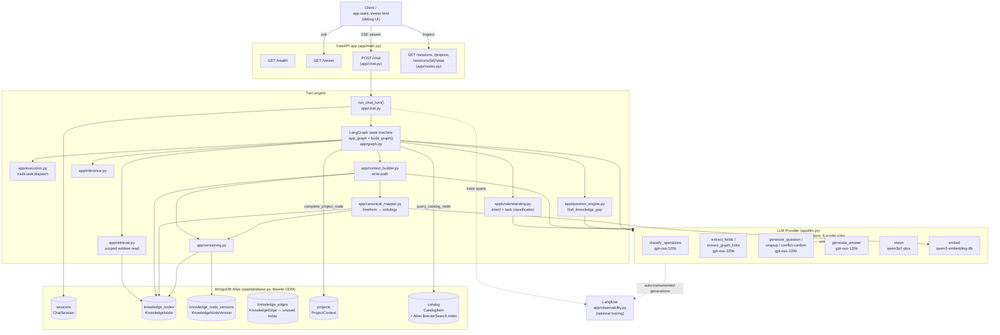
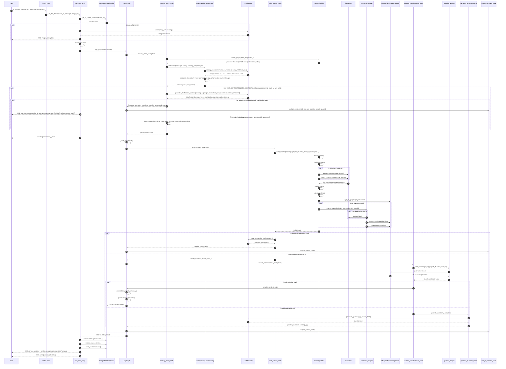
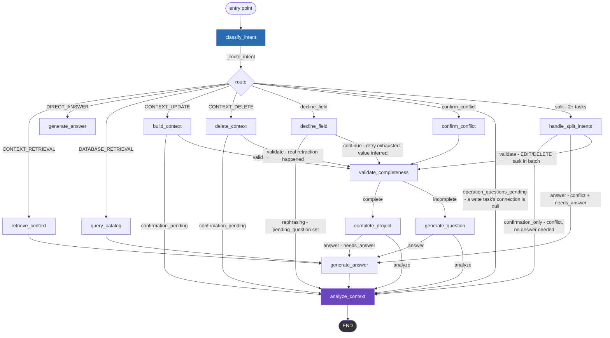
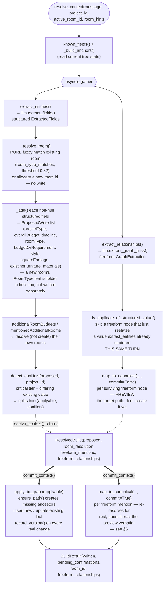
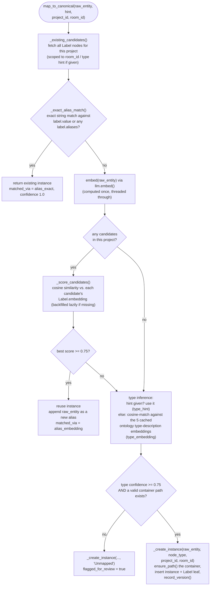
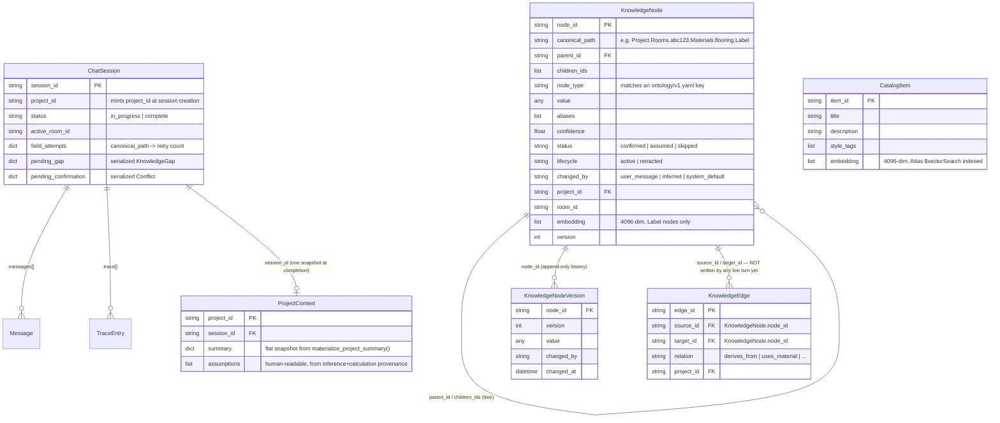
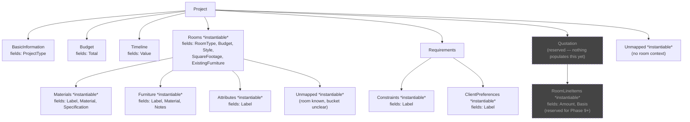

# System Flow — Interior Design Chat Backend

Complete architectural walkthrough of this repository: what runs, in what order, which
function calls which, and where every pointer/value actually moves. Written from direct
inspection of the code as of commit `f498203` (2026-08-09), updated in place on 2026-08-12 to
reflect the classifier-redesign work (see the classifier-redesign-decisions memory) — the
multi-operation `classify_operations` classifier and the resolve/cluster/commit write pipeline
it enabled — and updated again on 2026-08-13 to reflect the classifier-connection plan: each
`Operation` now also carries a project-grounded `connection`, the classifier's own system prompt
is fed the live project tree as plain text, and a multi-op turn with an unresolved connection
holds for a clarifying-question round trip before anything writes. **Not** from
`ARCHITECTURE_BASELINE.md`, which documents an earlier, now-superseded shape of the system (it
says so itself — see
[Note on `ARCHITECTURE_BASELINE.md`](#note-on-architecture_baselinemd) at the end of this
document).

## Table of contents

1. [30-second summary](#30-second-summary)
2. [System architecture overview](#1-system-architecture-overview)
3. [Request sequence — one `/chat` turn](#2-request-sequence--one-chat-turn)
4. [The LangGraph state machine](#3-the-langgraph-state-machine)
5. [Node-by-node deep dive](#4-node-by-node-deep-dive)
6. [The write path: `build_context()` in detail](#5-the-write-path-build_context-in-detail)
7. [The canonical mapper: freeform → ontology](#6-the-canonical-mapper-freeform--ontology)
8. [Data model](#7-data-model)
9. [The ontology tree (`ontology/v1.yaml`)](#8-the-ontology-tree-ontologyv1yaml)
10. [Module inventory — wired vs. staged](#9-module-inventory--wired-vs-staged)
11. [Model routing (Fireworks AI)](#10-model-routing-fireworks-ai)
12. [Observability / tracing](#11-observability--tracing)
13. [SSE event catalog](#12-sse-event-catalog)
14. [Field tiers & retry policy](#13-field-tiers--retry-policy)
15. [Note on `ARCHITECTURE_BASELINE.md`](#note-on-architecture_baselinemd)

---

## 30-second summary

A FastAPI backend that conducts a multi-turn chat "intake interview" for an interior
design project. Each `POST /chat` call runs one turn through a **LangGraph** state
machine: classify what the user meant → write anything they stated into a **canonical
knowledge tree** stored in MongoDB (`KnowledgeNode` documents, one row per fact, path-addressed
like a filesystem) → figure out what's still missing → ask for it, or answer a direct
question, or wrap up once the project is complete. Every LLM call goes through one
OpenAI-compatible provider (currently **Fireworks AI** — see
[§10](#10-model-routing-fireworks-ai) for why `app/llm.py`'s naming doesn't bake the vendor
in), routed to one of five role-specific models. The whole turn streams back to the client as
**Server-Sent Events**.

---

## 1. System architecture overview

**Key structural fact:** as of this snapshot, `KnowledgeNode` (a path-addressed tree, one
document per fact) is the **live source of truth** for every project fact. The older
`PartialContext` / `ContextGraph` model described in `ARCHITECTURE_BASELINE.md` has been
fully replaced — `ChatSession` today only holds dialogue mechanics (messages, retry
counters, the currently-pending question), not project facts.

---

## 2. Request sequence — one `/chat` turn

This traces the richest branch (`CONTEXT_UPDATE`, i.e. the user stated a new fact) since it
touches the most machinery. Other branches (`DIRECT_ANSWER`, `DATABASE_RETRIEVAL`,
`CONTEXT_RETRIEVAL`, `CONTEXT_DELETE`, decline, confirm) are narrower slices of the same
pipeline — see [§4](#4-node-by-node-deep-dive) for each.

Notes baked into the code that matter for this diagram:

- `run_chat_turn` drains the graph's async stream via a **queue + `asyncio.wait`**, not
  `wait_for` — a deliberate fix for a race that silently dropped `extract_fields`'
  output on ~2/3 of turns that straddled the 8-second heartbeat interval (see the comment
  in `app/chat.py`).
- `extract_fields` and `extract_graph_links` inside `build_context()` run **concurrently**
  via `asyncio.gather` (not sequentially like the old, now-removed `extract_fields_node` →
  `update_context_graph_node` pair `ARCHITECTURE_BASELINE.md` describes).
- Every node result flows back into `GraphState["trace"]`, which uses LangGraph's
  `operator.add` reducer — trace entries accumulate across the whole turn rather than being
  overwritten node-to-node.
- This diagram traces a single-operation turn (`len(tasks) == 1`), where `build_context_node`
  calls `context_builder.build_context()` directly. `build_context()` itself is now just
  `resolve_context()` (extraction + room/freeform-mention resolution, writes only idempotent
  container scaffolding, never a field value) followed by `commit_context()` (the actual
  `detect_conflicts`/`apply_to_graph` writes, plus committing each freeform mention for real).
  A multi-operation turn (`classify_operations` split the message into 2+ operations) instead
  routes through `execution.execute()`, which resolves every `EDIT_CONTEXT`/`DELETE_CONTEXT`
  task concurrently, clusters tasks whose resolved targets overlap (same room, same path, or
  the same not-yet-created room/entity name), then commits each cluster sequentially — deletes
  before edits — while independent clusters commit concurrently. See
  [§5](#5-the-write-path-build_context-in-detail) and `app/execution.py`'s own docstrings.
- Each `Operation` classify_operations returns now also carries a **`connection`** — a
  root-relative canonical path, a not-yet-existing room/entity name, or `null` — grounded
  against the project's live state via a plain-text tree the prompt receives (see
  `context_builder.render_project_tree_text`, §4's `classify_intent_node` entry). `connection`
  is an *anchor hint* into `resolve_context`/`canonical_mapper`, not a final write path — it
  narrows which room a task resolves against and seeds `execution._resolve_write_task`'s
  clustering keys before `resolve_context` even runs, but every leaf-level create-vs-update
  decision still goes through `canonical_mapper` exactly as before. If any `EDIT_CONTEXT`/
  `DELETE_CONTEXT` task in a **multi-op** turn comes back with `connection: null`,
  `classify_intent_node` calls `llm.generate_clarification_question()` once per unresolved op
  (concurrently) to judge whether the ambiguity is real. Only if at least one op comes back
  `needs_clarification: true` does it hold the *entire* batch — resolved and unresolved tasks
  alike — for a clarifying-question round trip instead of proceeding to normal routing
  (`operation_questions_pending`, see the flowchart below and §4); an op the model judges
  resolvable on its own (`needs_clarification: false`) simply keeps `connection: null` and
  proceeds through the ordinary single-op resolve fallback, same as before this gate existed.
  The client answers via `ChatRequest.operation_answers` (`{op_id: chosen_value}`) on the next
  request; that reply is merged into the stashed tasks with **no re-classification call** — see
  `classify_intent_node`'s resume branch. If any op is still unresolved after the merge, the
  same LLM-judged cycle runs again for just that op, so the round trip repeats until every
  `connection: null` in the batch is gone before anything downstream executes. A
  single-operation turn's `connection` is never checked this way — its own extraction already
  resolves its room reasonably well, same precedent the old (now-removed) regex `room_hint`
  auto-detector used.

---

## 3. The LangGraph state machine

`app/graph.py: build_graph()` wires 13 nodes plus `END`. Solid arrows are unconditional
edges; labelled arrows are the conditional-edge branches, each driven by a small pure
routing function (`_route_*`) that inspects `GraphState`, never the raw LLM output directly.

`analyze_context` is the **universal tail node** — every branch flows through it. Its job:
if nothing already queued a question/confirmation this turn (`question_generated` flag),
compute the next knowledge gap and generate a question for it, so a turn that answered an
unrelated question never silently drops the interview's own next question.

---

## 4. Node-by-node deep dive

Each entry: the graph node, the function(s) it calls beneath it, and what it reads/writes.

### `classify_intent_node`

Fetches `context_builder.render_project_tree_text(project_id)`, then calls
`understanding.understand(message, history, pending_field, tree_text)` — unless this turn is
resuming a held `pending_operation_questions` batch, in which case it skips straight to the
merge branch below (no classifier call at all).

- `understand()` calls `llm.classify_operations()` (`openai/gpt-oss-120b`, structured
  output via `instructor`'s TOOLS mode) — ONE call that splits the message into independent
  operations, labels each with exactly one of 5 intents (`CONTEXT_UPDATE` / `CONTEXT_DELETE` /
  `CONTEXT_RETRIEVAL` / `DATABASE_RETRIEVAL` / `DIRECT_ANSWER`), and grounds each one to a spot
  in the live project tree via **`connection`** — a root-relative canonical path (e.g.
  `"Rooms.a1b2c3d4.Materials.countertop"`), a not-yet-existing room/entity name (e.g.
  `"Living Room"`), the literal sentinel `"Project"` for project-wide facts, or `null` when it
  can't confidently place the operation. The system prompt is a verbatim, user-authored template
  (`app/prompts.py: CLASSIFY_OPERATIONS_SYSTEM_TEMPLATE`) with a `{{current_data_tree}}`
  placeholder substituted (plain string replace, not `.format()`) by
  `render_project_tree_text()`'s output — the plain-text, root-relative, value-only rendering of
  the live `KnowledgeNode` tree (no internal bookkeeping fields, nulls omitted entirely). This
  replaced an earlier pipeline (single/rarely-double-label `classify_intent` + three
  deterministic guards + a regex room-splitter) — none of that code exists anymore.
- Each `Operation.id` is assigned in Python by list order (`"op_1"`, `"op_2"`, ...) after
  parsing — never requested from the model, so a duplicate/missing id can't happen.
- If the model returns an empty operations list (its own prompt's RULE 19, for unclear/no-op
  input), `understand()` falls back to a single `DIRECT_ANSWER` operation over the whole
  message, so a turn always gets a reply.
- Each `Operation`'s intent maps to a `TaskType` via `_INTENT_TO_TASK_TYPE` (a full bijection —
  `CONTEXT_DELETE` is a real classifier label now, not a guard-derived override). Its `text`
  becomes the resulting `TaskSpec.target` directly (never `None`); `op_id`/`connection` carry
  through unchanged onto `TaskSpec`. `TaskSpec.room_hint` is never auto-derived here anymore —
  `app/execution.py` and `app/graph.py` derive it locally, per task, from `connection`
  instead (`canonical_mapper.split_connection`) when they resolve/commit each write.
- **Clarifying-questions branch** (multi-op turns only — a single operation's own extraction
  already resolves its room reasonably well, same precedent the old regex `room_hint`
  auto-detector used): if any `EDIT_CONTEXT`/`DELETE_CONTEXT` task's `connection` is still
  `null` after classification (or after merging a partial answer on a resume turn), this calls
  `_generate_operation_questions()`, which fans out one `llm.generate_clarification_question()`
  call per unresolved op (`app/prompts.py: GENERATE_CLARIFICATION_QUESTION_SYSTEM_TEMPLATE`, a
  verbatim, user-authored template fed the op's own text/intent, the turn's message, and the
  live tree). Each call returns `{needs_clarification, question, options}` — the model itself
  decides whether the ambiguity is real, not a fixed rule. Only the ops flagged
  `needs_clarification: true` become entries in the returned question list
  (`{op_id, text, question, options: [{id, label}], allow_custom: true}` — `options` come from
  the model, grounded only in the tree/message per its own prompt rules, never invented; a
  `null`-question response is simply left out). If that list is non-empty,
  `classify_intent_node` returns `pending_operation_questions` (`{tasks: [...], questions:
  [...]}`) and `question_generated: true` instead of proceeding — `_route_intent`
  short-circuits straight to `analyze_context`, so nothing in the batch executes this turn. If
  every unresolved op came back `needs_clarification: false`, the question list is empty and
  the turn falls through to normal routing with those ops' `connection` still `null` (same
  single-op resolve fallback a plain single-operation turn already relies on). The reply's
  `operation_answers` (`{op_id: chosen_value}`) round-trips via
  `ChatSession.pending_operation_questions`, exactly like `pending_confirmation`/`pending_gap`
  already do — the resume turn merges answers into the stashed tasks and, if every op is now
  resolved, proceeds to normal routing without ever calling `classify_operations` again; if any
  op is still unresolved, the whole clarification cycle (LLM call, batch-hold decision) repeats
  for just that op.
- Writes to `GraphState`: `intent` (human-readable telemetry only), `tasks` (what routing
  actually reads), `pending_operation_questions`, `trace`.

### `_route_intent`

Pure function, no LLM/DB call. Priority order: `pending_confirmation` set → `confirm_conflict`;
declined pending question with no edit/delete task → `decline_field`; `len(tasks) > 1` →
`split`; else the single task's type maps through `TASK_TYPE_TO_INTENT` (a full bijection over
every `TaskType`, `DELETE_CONTEXT` included) to one of `CONTEXT_RETRIEVAL` /
`DIRECT_ANSWER` / `DATABASE_RETRIEVAL` / `CONTEXT_UPDATE` / `CONTEXT_DELETE`, which the graph's
conditional-edge map routes to `retrieve_context` / `generate_answer` / `query_catalog` /
`build_context` / `delete_context` respectively.

### `retrieve_context_node`

Calls `retrieval.retrieve_scoped(message, project_id)`:

- `resolve_query_to_path()` fuzzy-matches a room name in the query against existing rooms
  (rapidfuzz `partial_ratio`, threshold 70) → `"Project.Rooms.<id>"` or falls back to the
  whole `"Project"` subtree.
- `load_subtree()` fetches every active `KnowledgeNode` at or under that path, depth-limited
  to 2 path segments beyond the root — never dumps the whole project tree for a scoped question.
- Result formatted into a flat summary string, written to `GraphState["retrieved"]`.

### `query_catalog_node`

Calls `rag.query_catalog(message)`:

- `llm.embed([query])` → 4096-dim vector (Qwen3-Embedding-8B).
- MongoDB Atlas `$vectorSearch` aggregation against the `catalog` collection's
  `catalog_vector_index`, `numCandidates = limit * 20`, top 5 by cosine similarity.
- Result formatted into `GraphState["retrieved"]`.

### `build_context_node`

The main write path — delegates entirely to `context_builder.build_context()`, detailed in
[§5](#5-the-write-path-build_context-in-detail). On return:

- If `BuildResult.pending_confirmations` is non-empty, calls
  `llm.generate_conflict_confirmation()` and sets `pending_confirmation` +
  `question_generated=True` — nothing new was applied this turn.
- Otherwise calls `_summarize_written()` (deterministic, no LLM) to build the "Got it — noted
  ..." acknowledgment from the list of canonical paths actually written.

### `delete_context_node`

Handles a `DELETE_CONTEXT` task:

1. `_match_room_for_deletion()` — strips the trigger verb via `_DELETE_CORE_PHRASE_RE`, then
   whole-string fuzzy-matches (rapidfuzz `ratio`, threshold 82) against existing room names.
   A match routes to `_handle_room_deletion()`, which always holds a room deletion for
   confirmation (critical tier) — the actual `versioning.retract_subtree()` cascade only
   fires once `confirm_conflict_node` sees an affirmative reply next turn.
2. Otherwise, `canonical_mapper.resolve_deletion_target()` (embedding-based, stricter
   threshold 0.85 than normal matching's 0.75, since a wrong retraction can't be undone)
   against **live** freeform facts only:
   - `outcome == "none"` → clarification question, no state change.
   - `outcome == "ambiguous"` → lists candidates, asks which one, no state change.
   - `outcome == "single"` → critical tier → held for confirmation; else →
     `versioning.retract_node()` immediately.

### `confirm_conflict_node`

Reads `state["pending_confirmation"]`, classifies the reply as affirmative/negative/ambiguous
via narrow deterministic phrase lists (`_is_affirmative` / `_is_negative` — no LLM call).
Affirmative applies the held-back write (`apply_to_graph`) or runs the held-back retraction
(`versioning.retract_node` / `retract_subtree`); anything else discards the pending change and
leaves the graph untouched. Never mines the reply for additional facts.

### `handle_split_intents_node`

Wrapped in its own `_node_span` (like every other node — this used to be the one exception),
producing a `handle_split_intents` `TraceEntry` summarizing the whole batch, then delegates to
`execution.execute(state["tasks"], state)`. `RETRIEVE_CONTEXT`/`DATABASE_QUERY` tasks dispatch
immediately, concurrently, each wrapped so its own failure is caught and isolated
(`execution._dispatch_read_task`) — they never wait on a write, even a connected one.
`EDIT_CONTEXT`/`DELETE_CONTEXT` tasks go through a resolve → cluster → commit pipeline instead
of a flat gather:

1. **Resolve** every write task concurrently — `context_builder.resolve_context()` for
   `EDIT_CONTEXT`, `graph.resolve_delete_target()` for `DELETE_CONTEXT` — this is the "parallel
   LLM work" (extraction) part.
2. **Cluster** tasks whose resolved target-key sets overlap (exact write path, shared room
   prefix, or a shared not-yet-created-room/entity-name key — see `execution._resolve_write_task`)
   into connected components via union-find (`execution._cluster`).
3. **Commit** each cluster sequentially — every `DELETE_CONTEXT` task first (original order),
   then every `EDIT_CONTEXT` task (original order); only the first task in a cluster reuses its
   already-resolved plan, every task after that re-resolves fresh right before committing, since
   an earlier same-cluster write may have changed what "existing vs. new" means. Independent
   clusters commit concurrently with each other.

Every task — read or write — pushes one `operation_progress` custom stream event
(`execution._progress_event`) the moment it finishes, via LangGraph's `get_stream_writer()`
(safely no-op'd outside a real graph run, e.g. `tests/test_execution.py` calling `execute()`
directly — see `execution._stream_writer`). This is what lets a live client see each operation
land one at a time instead of only finding out the whole batch finished, all at once, after
the fact — see [§12](#12-sse-event-catalog).

Results merge the same way regardless of path: concatenates `retrieved` text, joins
`update_summary` strings, takes the **first** conflict/question across the whole batch (rest
wait for a later turn), and sets `needs_answer=True` whenever an `EDIT_CONTEXT`/`DELETE_CONTEXT`
task was present.

### `decline_field_node`

Reads `pending_gap`, increments `field_attempts[canonical_path]`. Under the field's tier
retry budget → `generate_question(is_retry=True)` for a rephrase. Budget exhausted →
`inference.infer_field()` writes a best-guess value immediately (`changed_by="inferred"`)
instead of leaving the field open forever.

### `validate_completeness_node`

Calls `question_engine.find_knowledge_gap(project_id, active_room_id)`; `complete = gap is None`.

### `generate_question_node`

Re-derives the same gap (guaranteed non-None, since routing only reaches here when
incomplete), fetches `context_builder.known_fields()`, calls
`question_engine.generate_question()` → `llm.generate_question()`.

### `complete_project_node`

No inference sweep needed here (every field already got a real value the moment its retry
budget was exhausted, via `decline_field_node`). Calls
`context_builder.materialize_project_summary()` (flat read-side snapshot of the tree),
`_build_assumptions()` (queries `inference.list_inferred()` + `calculation.list_calculated()`
for provenance-based "assumed" notes), inserts a `ProjectContext` document, and generates the
closing wrap-up line via `llm.generate_wrapup_message()`.

### `generate_answer_node`

Runs the answer generation and (if not already queued) the next question **concurrently**
via `asyncio.gather` — `llm.generate_answer()` streams tokens through LangGraph's
`get_stream_writer()` (surfaces as SSE `token` events), while a second coroutine derives the
next `find_knowledge_gap()`/`generate_question()` in parallel.

### `analyze_context_node`

Runs on every branch. No-ops if `question_generated` is already `True`. Otherwise computes
the gap and generates the next question — the safety net that guarantees the interview never
silently stalls regardless of which branch a turn took.

---

## 5. The write path: `build_context()` in detail

The single most complex function in the system (`app/context_builder.py`). Called once per
`EDIT_CONTEXT` task (directly, or once per task from `execution.execute()` on a multi-operation
turn). `build_context()` itself is now a two-line wrapper — `resolve_context()` (everything up
to and including `Conflicts`/`Dedup` below: read-mostly, the only writes are idempotent
container scaffolding via `ensure_path`, never a field value) followed by `commit_context()`
(`Apply` and `Map` below: the actual field-value writes). `execution.execute()`'s clustering
calls these two phases separately — see [§4](#4-node-by-node-deep-dive)'s
`handle_split_intents_node` entry.

Things worth knowing that aren't obvious from the diagram:

- **`detect_conflicts`** is the entire conflict-resolution policy: a write only conflicts
  when a node already exists at that path with a _different, non-null_ value **and** the
  field's tier is `critical`. Moderate/optional fields, and any field with no prior value,
  apply automatically — no confirmation loop for low-stakes edits.
- **`apply_to_graph`** is a true no-op detector: a write whose value is identical to what's
  already stored bumps nothing and isn't included in the `written` list, so a same-turn
  restatement of an already-known fact doesn't pad out the "Got it — noted ..." message.
- `extract_relationships` always passes empty `candidate_nodes`/`recent_edges` — revise/retract
  targeting via this path is out of scope for the current phase; `retracted_node_ids` the
  model returns are logged and **not applied** (`KnowledgeEdge` writing isn't wired to a live
  turn — see [§9](#9-module-inventory--wired-vs-staged)).
- **The resolve/commit split is deliberately not a strict promise.** `commit_context()`
  re-runs `map_to_canonical()` for real (full lookup, not just the `commit=False` preview) for
  every freeform mention, and a new room's `RoomType` leaf only gets written once (via the
  ordinary `ProposedWrite` batch) at commit time. This matters once `execution.execute()`'s
  clustering sequences several tasks' commits back to back: a later task in the same cluster
  re-resolving against the state an earlier one just committed is what lets two operations
  that both wanted a not-yet-existing room/entity end up creating it once, not twice.

---

## 6. The canonical mapper: freeform → ontology

`app/canonical_mapper.py: map_to_canonical()` resolves one freeform entity mention (e.g. "TV
Cabinet" from `extract_graph_links`) to exactly one canonical `KnowledgeNode`, reusing an
existing instance when the mention is really the same thing already captured, and only
creating a new node when it genuinely isn't.

The five freeform "fact bucket" types this mapper ever classifies into:
`Materials`, `Furniture`, `Attributes`, `Constraints`, `ClientPreferences` — structured slot
fields (`ProjectType`, `Budget`, `Style`, `RoomType`, `SquareFootage`, `ExistingFurniture`,
`Timeline`) never go through this path; `extract_fields`'s schema is already unambiguous for
those.

`resolve_deletion_target()` (used by `delete_context_node`) is a **separate, read-only** entry
point: same candidate pool, restricted to `lifecycle="active"` nodes, but with a stricter
match threshold (0.85 vs. 0.75) and an explicit ambiguity check (two candidates within 0.05
of each other → `"ambiguous"`, not a guess) — it never creates anything, unlike
`map_to_canonical`.

`map_to_canonical()` also takes a `commit: bool = True` parameter (default preserves the
behavior above). `commit=False` computes the exact same `CreateNew`/`Unmapped` target path
(via a shared `_resolve_instance_path` helper) but returns it as a **preview** —
`node_id=""`, nothing written — instead of calling `_create_instance`. Used by
`context_builder.resolve_context()` so a caller can learn a freeform mention's target path
before any turn's writes commit; existing-node matches (`alias_exact`/`alias_embedding`) are
unaffected by `commit` either way, since reusing an already-resolved node isn't a pending
write.

---

## 7. Data model

Two important asymmetries:

- **`ChatSession` vs. `KnowledgeNode`**: `ChatSession` is _dialogue mechanics_ (what's
  pending, how many retries used) and has a 30-day TTL index on `updated_at`.
  `KnowledgeNode` is the _actual project facts_ — no TTL, keyed by `project_id`, and is what
  every read path (`known_fields`, `find_knowledge_gap`, `retrieve_scoped`) queries directly.
  A session's `project_id` is minted at session creation, so every `KnowledgeNode` a session
  ever writes carries that id from turn 1.
- **`ProjectContext` is a snapshot, not the source of truth** — written once by
  `complete_project_node`, never read back by the live turn. It exists for the REST inspection
  endpoints and as a durable, non-TTL'd completion record.

---

## 8. The ontology tree (`ontology/v1.yaml`)

Every `canonical_path` in `KnowledgeNode` is built from real keys in this file — nothing in
`app/canonical_mapper.py` can invent a path outside it.

`instantiable: true` means zero-or-many runtime instances keyed by an opaque id (a room id,
or a slugified entity name) — e.g. `Project.Rooms.a1b2c3d4.Materials.flooring` is one
`Materials` instance. `versioning_policy: additive-only` — an existing `canonical_path` is
never renamed, only deprecated.

---

## 9. Module inventory — wired vs. staged

This codebase is mid-rearchitecture (see the `ontology/PHASE*.md` docs). Several modules are
fully built and tested but **not yet called from any live turn** — they're staged for future
phases. This table separates the two, based on actually tracing imports from `app/graph.py`
outward (not from each module's own docstring, some of which are stale — see callout below).

| Module                    | Role                                                               | Wired into the live turn?                                                                                                                                                               |
| ------------------------- | ------------------------------------------------------------------ | --------------------------------------------------------------------------------------------------------------------------------------------------------------------------------------- |
| `app/chat.py`             | SSE transport, turn orchestration                                  | ✅ entry point                                                                                                                                                                          |
| `app/graph.py`            | LangGraph state machine, all 13 nodes                              | ✅                                                                                                                                                                                      |
| `app/understanding.py`    | Multi-operation intent classification (`classify_operations`)      | ✅                                                                                                                                                                                      |
| `app/execution.py`        | Multi-task dispatch — reads concurrent, writes resolve+cluster+ordered-commit | ✅ (`handle_split_intents_node`)                                                                                                                                                        |
| `app/tasks.py`            | `TaskType`/`TaskSpec` vocabulary                                   | ✅                                                                                                                                                                                      |
| `app/context_builder.py`  | The write path (`build_context`, `apply_to_graph`, `known_fields`) | ✅                                                                                                                                                                                      |
| `app/canonical_mapper.py` | Freeform entity → ontology resolution                              | ✅ (via `context_builder`)                                                                                                                                                              |
| `app/question_engine.py`  | `find_knowledge_gap`, question generation adapter                  | ✅                                                                                                                                                                                      |
| `app/retrieval.py`        | Scoped subtree read for context-related questions                  | ✅ (`retrieve_context_node`)                                                                                                                                                            |
| `app/rag.py`              | Catalog vector search                                              | ✅ (`query_catalog_node`)                                                                                                                                                               |
| `app/inference.py`        | LLM best-guess fill for exhausted-retry fields                     | ✅ (`decline_field_node`)                                                                                                                                                               |
| `app/versioning.py`       | Append-only history, retraction                                    | ✅ (used throughout the write path)                                                                                                                                                     |
| `app/llm.py`        | All LLM calls, single client, 6 model roles                        | ✅                                                                                                                                                                                      |
| `app/calculation.py`      | Deterministic calculated values                                    | ⚠️ partially — `list_calculated()` (read) is used by `complete_project_node`; `calculate_and_record()` (write) has no caller — no calculation rule exists anywhere in this codebase yet |
| `app/facts.py`            | `list_facts()` — "which values were client-stated"                 | ❌ not imported anywhere                                                                                                                                                                |
| `app/dependency_graph.py` | Generic recompute-on-change mechanism (`KnowledgeEdge` walker)     | ❌ not imported by anything in `app/` except `graph_reasoning.py`                                                                                                                       |
| `app/graph_reasoning.py`  | Precomputed graph queries (`rooms_exceeding_budget`, etc.)         | ❌ not imported anywhere; also depends on `Project.Quotation.RoomLineItems`, which nothing populates                                                                                    |

> **Docstring caveat:** `question_engine.py`, `retrieval.py`, and `canonical_mapper.py` each
> contain a docstring claiming "not wired into the live turn yet" — those docstrings predate
> the cutover and were never updated after `app/graph.py`/`app/context_builder.py` started
> calling them. Trust the import graph (traced above), not the prose, when in doubt.

`KnowledgeEdge` deserves its own callout: the model exists, indexes exist
(`app/database.py`), but **no live code path ever writes one** — `extract_relationships`'s
`new_edges` are surfaced in `BuildResult.freeform_relationships` and then simply discarded by
`build_context_node`. Relationship edges are extracted but not persisted.

---

## 10. Model routing (Fireworks AI)

One `AsyncOpenAI` client (`app/llm.py`), wrapped by `instructor` (`Mode.TOOLS`) for
structured-output calls, single API key, six role-scoped models. `app/llm.py`/`app/config.py`
deliberately don't bake the vendor into any name (`llm_api_key`, `llm_base_url`, `client`,
`structured_client`) — the provider was DeepInfra until a switch to **Fireworks AI** on
2026-08-13; switching again later is a config change (base URL + API key + the slugs below),
not a rename sweep.

| Role                               | Function(s)                                                                                                                        | Model                              | Notes                                                                                             |
| ---------------------------------- | ---------------------------------------------------------------------------------------------------------------------------------- | ---------------------------------- | ------------------------------------------------------------------------------------------------- |
| Intent + multi-operation split + graph connection | `classify_operations`                                                                                               | `accounts/fireworks/models/gpt-oss-120b` | via `instructor` TOOLS mode, same two-stage retry + salvage strategy as extraction (`_salvage_operations`); moved off an 8B Turbo model, then off `Llama-3.3-70B-Instruct-Turbo`, since splitting a message into several correctly-scoped, graph-grounded operations is a harder task than the single-label classification it originally replaced. System prompt is fed the live project tree as plain text (`context_builder.render_project_tree_text`) so each operation's `connection` can be grounded against real state. |
| Clarifying-question judgment + generation | `generate_clarification_question`                                                                                   | `accounts/fireworks/models/gpt-oss-120b` | via `instructor` TOOLS mode, same two-stage retry + salvage strategy (`_salvage_clarification_question`); one call per `EDIT_CONTEXT`/`DELETE_CONTEXT` op whose `connection` is still `null`, run concurrently across a turn's unresolved ops. Shares `classify_operations`' model since it's the same class of tree-grounded reasoning (is this ambiguity real, and if so what are the real candidates) rather than plain text generation. |
| Structured extraction              | `extract_fields`                                                                                                                   | `accounts/fireworks/models/gpt-oss-120b` | via `instructor`, two-stage retry + `_salvage_extracted_fields` fallback for TOOLS-mode flakiness |
| Freeform graph links               | `extract_graph_links`                                                                                                              | `accounts/fireworks/models/gpt-oss-120b` | same salvage strategy (`_salvage_extracted_graph_links`)                                          |
| Question / wrap-up / conflict text | `generate_question`, `generate_wrapup_message`, `generate_conflict_confirmation(_delete)`, `infer_missing_field`, `merge_response` | `accounts/fireworks/models/gpt-oss-120b` | consolidated onto the same model as every other text role after the Fireworks switch — see the reasoning-model caution below |
| Answer generation                  | `generate_answer`                                                                                                                  | `accounts/fireworks/models/gpt-oss-120b` | streamed token-by-token                                                                           |
| Vision                             | `vision`                                                                                                                           | `accounts/fireworks/models/qwen3p7-plus` | image → text description; not confirmed live on Fireworks — verify before relying on it           |
| Embedding                          | `embed`                                                                                                                            | `accounts/fireworks/models/qwen3-embedding-8b` | same model family as the previous DeepInfra choice, chosen to keep the embedding vector space stable across the provider switch; used by `canonical_mapper` and `rag.query_catalog` |

History (all on DeepInfra at the time): the extraction/question-gen models were previously
`GLM-4.7-Flash` (a reasoning model burning 8–23s/call on invisible chain-of-thought) then
`Mistral-Small-3.2-24B` (11–62s/call regardless of output length — almost certainly served on
a cold/shared DeepInfra tier). Both were replaced by reusing the same 8B Turbo model already
proven fast on the intent-classification role at the time (consistently <2–3s/call). The
classifier role itself later moved to a larger model — `Llama-3.3-70B-Instruct-Turbo`, then
`gpt-oss-120b`. After the Fireworks switch every text/reasoning role was consolidated onto
that one `gpt-oss-120b` deployment (see the table above) — it's itself a reasoning model, so
the same latency caution this history documents is worth re-checking live, not assumed fixed,
especially for `generate_answer` (the role streamed token-by-token to the client).

---

## 11. Observability / tracing

Two independent, additive layers:

1. **`TraceEntry` (always on)** — every graph node appends one or more `TraceEntry` rows
   (`node_name`, `model_used`, truncated `input_summary`/`output_summary`, `duration_ms`,
   and — for LLM-calling nodes — full untruncated `llm_input`/`llm_output`) to
   `GraphState["trace"]` via the `operator.add` reducer. `run_chat_turn` copies the final
   list onto `session.trace` and streams each node's entries to the client as SSE `trace`
   events. This is what the debug viewer's "Process Trace" panel reads.
2. **Langfuse (optional)** — `app/observability.py` constructs the Langfuse singleton at
   import time, **before** `app/llm.py` is imported anywhere, so the provider's
   `AsyncOpenAI` client (imported from `langfuse.openai`, not plain `openai`) auto-captures
   every completion as a generation with real token usage/cost/latency. `app/graph.py`'s
   `_node_span()` context manager wraps each node's work in a named span, nesting under one
   `chat_turn` root span per turn (started in `run_chat_turn`). Fully disabled (no network
   calls) when `LANGFUSE_PUBLIC_KEY`/`SECRET_KEY` aren't set.

---

## 12. SSE event catalog

Emitted by `run_chat_turn()`, formatted onto the wire by `POST /chat` in `app/chat.py`:

| Event `type`               | When                                                       | Payload                                                                   |
| -------------------------- | ---------------------------------------------------------- | ------------------------------------------------------------------------- |
| `image_description`        | An `image_url` was provided                                | `content: str`                                                            |
| `token`                    | Streamed during `generate_answer_node`                     | `content: str`                                                            |
| `progress`                 | After every graph node completes                           | `node: str`                                                               |
| `trace`                    | Alongside `progress`, when a node produced trace entries   | `node: str, entries: list[TraceEntry]`                                    |
| `operation_progress`       | One per task, as it finishes, during a multi-operation turn (`execution.execute()`) | `task_type: str, target: str, ok: bool` — finer-grained than `progress`, which only fires once for the whole `handle_split_intents` batch |
| `context_updated`          | A fact was written this turn (no conflict)                 | `message: str` (the "Got it — noted ..." line)                            |
| `confirm_change`           | A critical-tier value/room/item would change or be removed | `field, old_value, new_value, question`                                   |
| `operation_questions`      | A multi-op turn had an `EDIT_CONTEXT`/`DELETE_CONTEXT` task whose `connection` came back `null` AND `llm.generate_clarification_question()` judged at least one of them genuinely ambiguous — the whole batch is held | `questions: [{op_id, text, question, options: [{id, label}], allow_custom: true}, ...]` — the viewer must render both the option list and a free-text input per question; reply via `ChatRequest.operation_answers: {op_id: chosen_value}` (either an option's label or typed text) on the next request |
| `ask_question`             | The next knowledge-gap question                            | `question: str`                                                           |
| `wrapup`                   | Project just reached completeness                          | `message: str`                                                            |
| `error`                    | Graph execution raised, or produced no result              | `message: str`                                                            |
| `done`                     | Always last                                                | `session_id: str, status: "in_progress" \| "complete"`                    |
| _(comment)_ `: keep-alive` | Graph has been quiet > 8s (`HEARTBEAT_SECONDS`)            | not a JSON event — a raw SSE comment line to defeat idle-connection drops |

`confirm_change`, `operation_questions`, `ask_question`, and `wrapup` are mutually exclusive
within one turn — see `build_context_node`'s, `classify_intent_node`'s, and
`complete_project_node`'s docstrings for why each guarantees it never sets more than one of
these paths per turn.

---

## 13. Field tiers & retry policy

From `app/models.py: FIELD_TIERS` / `RETRY_LIMITS`, consumed by `decline_field_node` and
`context_builder.detect_conflicts`:

| Field                                                             | Tier     | Rephrases allowed after first ask | Conflict-holds-for-confirmation? |
| ----------------------------------------------------------------- | -------- | --------------------------------- | -------------------------------- |
| `projectType`, `overallBudget`, `roomType`, `budgetOrRequirement` | critical | 3 (4 asks total)                  | yes                              |
| `style`, `squareFootage`, `timeline`                              | moderate | 1 (2 asks total)                  | no — applies automatically       |
| `existingFurniture`, `materials`                                  | optional | 0 (asked once, never rephrased)   | no                               |

A field whose retry budget is exhausted is never left blank: `decline_field_node` calls
`inference.infer_field()` immediately, so `find_knowledge_gap` naturally moves past it on the
next call — there is no separate "skipped" status that lingers in the live tree today (the
`FieldStatus` enum still defines `"skipped"`, but nothing in the current write path produces it).

---

## Note on `ARCHITECTURE_BASELINE.md`

That file is explicitly a **frozen Phase-0 snapshot** ("Do not edit this file to reflect
in-flight refactor work — it's a frozen reference point, not a living doc, superseded when
Phase 7 cuts over"). Phase 7 (`context_builder.py`) — and, per the trace above, several
phases beyond it — has since cut over. Where the two documents disagree (e.g.
`extract_fields_node`/`update_context_graph_node`/`save_project_node` in that doc vs.
`build_context_node`/`complete_project_node` here, or `PartialContext`/`ContextGraph` vs.
`KnowledgeNode`), **this document reflects the current, actually-running code**; the baseline
document reflects the system's starting point before the rearchitecture described in
`ontology/PHASE*.md` began.
