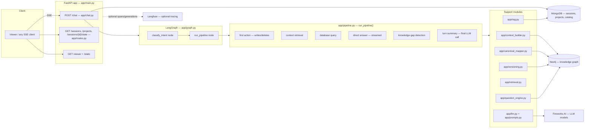
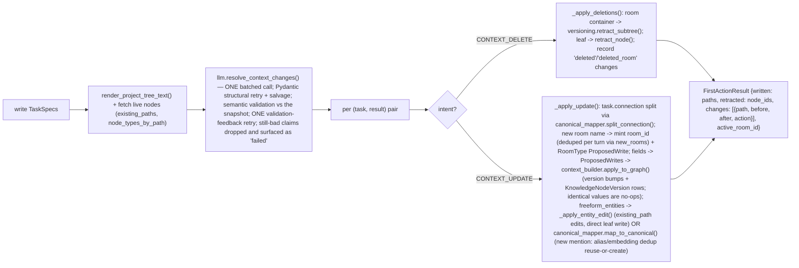
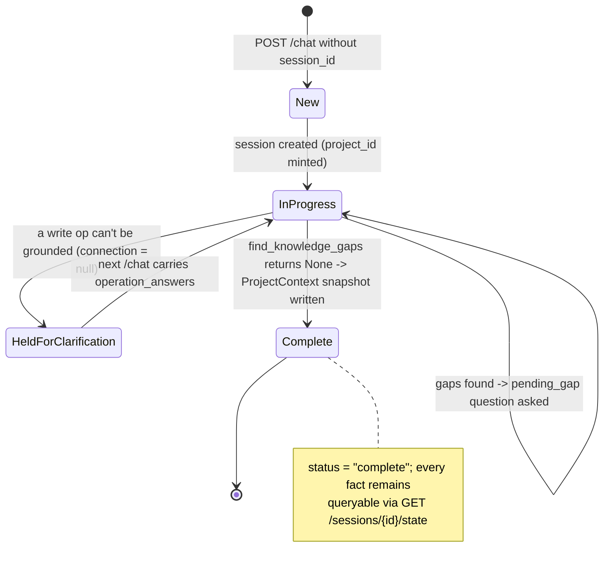

# System Flow Overview — Interior Design Chat

Companion document: **[MODULE_DETAILED_FLOW.md](MODULE_DETAILED_FLOW.md)** — per-module, per-function
deep dive (signatures, inputs, outputs, internal decision flows). This file covers the **whole system at
the turn level**: what happens when one user message arrives, end to end.

Everything below was written from the actual code in `app/` — not from the older `CHAT_SYSTEM_FLOW.md`
(which describes a previous architecture and is left untouched).

---

## 1. What the system is

A FastAPI + LangGraph chat backend that runs a **client intake conversation for interior-design
projects**. The user chats (text, optionally an image URL); the system:

1. Understands each message — splits it into independent **operations** with intents.
2. **Writes** facts the user states into a versioned knowledge tree (Neo4j).
3. **Retrieves** facts already stored when the user asks about the project.
4. **Searches** a product catalog (MongoDB Atlas vector search) when the user asks for products.
5. **Answers** general questions directly.
6. **Asks the next intake question** — it tracks which ontology-defined fields are still open and
   keeps the conversation moving until the project is complete.

### Technology map

| Concern | Technology | Where |
|---|---|---|
| HTTP / streaming transport | FastAPI + SSE | `app/main.py`, `app/chat.py` |
| Turn orchestration | LangGraph `StateGraph` (2 nodes) | `app/graph.py` |
| Per-turn work branches | Plain async functions | `app/pipeline.py` |
| All LLM calls | OpenAI-compatible client (Fireworks AI) via `instructor` | `app/llm.py`, prompts in `app/prompts.py` |
| Knowledge graph (project facts) | Neo4j (`:KNode`, `:KNodeVersion`, `:REL`) | `app/graph_store.py`, `app/neo4j_db.py` |
| Sessions / completion snapshots / catalog | MongoDB (+ Atlas Vector Search) | `app/database.py`, `app/models.py`, `app/rag.py` |
| Schema of the knowledge tree | YAML ontology | `ontology/v1.yaml` |
| Tracing | Langfuse (optional) | `app/observability.py` |

### The two databases, and what's in each

- **Neo4j** — the *live source of truth* for project facts. Every fact is a `KnowledgeNode` with a
  `canonical_path` drawn from `ontology/v1.yaml` (e.g. `Project.Rooms.a1b2c3d4.Style`). Nodes are
  connected by `:CHILD_OF` edges; every value change appends a `KnowledgeNodeVersion` row; deletion is
  a soft `lifecycle = "retracted"` flip — nothing is ever hard-deleted.
- **MongoDB** — dialogue mechanics (`ChatSession`: messages, trace, pending question state), the
  completion snapshot (`ProjectContext`), and the product catalog (`CatalogItem` + vector index).

---

## 2. Architecture map

---

## 3. The complete flow of one chat turn

```mermaid
flowchart TD
    A["Client: POST /chat {session_id?, message, image_url?, operation_answers?, operation_room_selections?}"] --> B["app/chat.py run_chat_turn()"]
    B --> C["get_or_create_session() — Mongo ChatSession {session_id, project_id, messages, trace, pending_gap, pending_operation_questions, skipped_rooms, active_room_id, status}"]
    C --> D["Build last-10-message history text + open Langfuse 'chat_turn' span"]
    D --> E{"image_url present?"}
    E -->|"yes"| E1["app/graph.py describe_image_node() -> llm.vision() -> description; emits 'trace' + 'image_description' events; description appended to message text"]
    E -->|"no"| E2["message unchanged"]
    E1 --> F["Assemble GraphState and stream app_graph (LangGraph) in a background task; heartbeat every 8s"]
    E2 --> F

    F --> G["NODE 1: classify_intent — app/graph.py"]

    G --> G1["Decline detection: if message is a decline phrase AND last question was room-scoped -> add room to skipped_rooms (no routing change)"]
    G1 --> G2{"pending_operation_questions from a prior turn?"}
    G2 -->|"yes: RESUME turn"| G3["Reload stashed tasks (NO new classification LLM call); merge operation_answers into each task's connection via _apply_operation_answers(); a bundled multi-room answer fans one task out into one task per room"]
    G2 -->|"no: FRESH turn"| G4["understanding.understand(): llm.classify_operations(message, history, pending_field, tree_text) -> list[Operation {text, intent, connection}] -> list[TaskSpec]; empty result falls back to one DIRECT_ANSWER op"]

    G3 --> G5{"any write/retrieve task still has connection = None?"}
    G4 --> G5
    G5 -->|"yes"| G6["_generate_operation_questions(): ONE llm.resolve_room_connections() call -> one clarifying multiple-choice question per unresolved op; whole turn's tasks stashed in pending_operation_questions; graph ENDs; emits 'operation_questions' event"]
    G5 -->|"no"| G7["_resolve_active_room() — best-effort which room this turn focuses on"]

    G6 --> Z1["Turn pauses: client answered via NEXT POST /chat carrying operation_answers"]
    Z1 -.->|"next turn"| G2

    G7 --> H["NODE 2: run_pipeline — app/pipeline.py run_pipeline()"]

    H --> H0["Partition tasks: write (EDIT/DELETE), retrieval, query, answer"]
    H0 --> P1
    H0 --> P2

    subgraph Concurrent["Started immediately, fully concurrent"]
        P1["DIRECT_ANSWER branch (if any ANSWER tasks): llm.generate_answer() STREAMED token-by-token -> 'token' SSE events"]
        P2["DATABASE_RETRIEVAL branch (if any DATABASE_QUERY tasks): llm.generate_search_keywords() -> rag.query_catalog() Atlas vectorSearch"]
    end

    H0 --> W{"write tasks present?"}
    W -->|"yes"| W1["FIRST ACTION (sequential): render tree text + live-node snapshot -> llm.resolve_context_changes() [validated, 1 semantic retry] -> per-op apply: new-room minting w/ same-turn dedup; DELETE -> versioning.retract_node / retract_subtree; UPDATE -> context_builder.apply_to_graph() [structured fields] + freeform entities -> _apply_entity_edit (existing) or canonical_mapper.map_to_canonical (new, alias/embedding dedup)"]
    W -->|"no"| W2["skip"]
    W1 --> J
    W2 --> J

    J["After writes land — CONTEXT_RETRIEVAL + gap detection run concurrently"]
    J --> K["retrieval.load_subtree() for each RETRIEVE_CONTEXT task's root path"]
    J --> L["question_engine.find_knowledge_gaps(project_id, active_room_id, skipped_rooms) -> KnowledgeGapBatch or None"]

    P2 --> M["Gather all branches"]
    K --> M
    L --> M
    M --> N{"gaps == None?"}
    N -->|"yes: project complete"| N1["_materialize_project(): ProjectContext snapshot (summary + inferred/calculated assumptions) -> Mongo"]
    N -->|"no"| N2["in progress"]
    N1 --> O
    N2 --> O{"anything happened this turn? (writes/retrieval/query/open gaps)"}
    O -->|"yes"| O1["llm.generate_turn_summary(pieces) -> TurnSummary {database_summary, context_summary, changes_summary, next_message, is_question}"]
    O -->|"no (pure DIRECT_ANSWER turn)"| O2["answer already streamed; no summary"]
    P1 --> R

    O1 --> R["Back in app/chat.py: persist user + assistant messages, skipped_rooms, active_room_id, trace, status ('complete' if gaps None), pending_gap OR pending_operation_questions; save_session() -> Mongo"]
    O2 --> R
    R --> S["Emit 'pipeline_result' (the turn's reply) + 'done' {session_id, status}; Langfuse span closed with output"]
```

---

## 4. Stage-by-stage explanation (input → what it does → expected output)

### Stage 0 — Application startup (`app/main.py::lifespan`)

| | |
|---|---|
| **Input** | Process start (`uvicorn app.main:app`) |
| **What it does** | `connect_to_mongo()` (Beanie init + indexes incl. the Atlas `catalog_vector_index`), `connect_to_neo4j()` (driver + uniqueness constraints/indexes). On shutdown: closes both and flushes Langfuse. |
| **Output** | Ready app; `GET /health` → `{"status": "ok"}` |

### Stage 1 — Request intake (`app/chat.py::chat` → `ChatRequest`)

| | |
|---|---|
| **Input** | JSON body: `session_id?` (null = new session), `message: str`, `image_url?`, `operation_answers?: {op_id: chosen_value}`, `operation_room_selections?: {op_id: [room_id, ...]}` |
| **What it does** | Wraps `run_chat_turn()` as a `text/event-stream` SSE response. |
| **Expected output** | A stream of `data: {...}` events (full list in §6) ending with a `done` event. |

### Stage 2 — Session load (`app/database.py::get_or_create_session`)

| | |
|---|---|
| **Input** | `session_id` or `None` |
| **What it does** | Finds the `ChatSession` in Mongo, or creates a new one — a new session **mints its `project_id` at creation**, so every `KnowledgeNode` the turn writes uses it. |
| **Expected output** | `ChatSession` document (messages, trace, `status`, `skipped_rooms`, `current_field`, `pending_gap`, `pending_operation_questions`, `active_room_id`). |

### Stage 3 — Optional image description (`app/graph.py::describe_image_node`)

| | |
|---|---|
| **Input** | `image_url` + the message text (or `DEFAULT_VISION_PROMPT`) |
| **What it does** | One vision-model call (`settings.model_vision`) describing the image; the description is appended to the message as `[Image description: ...]`. |
| **Expected output** | SSE `trace` + `image_description` events; downstream nodes see the enriched text. |

### Stage 4 — Intent classification & grounding (`app/graph.py::classify_intent_node`)

Three sub-behaviors:

1. **Decline detection** (deterministic, no LLM): if the message is essentially "skip / not sure /
   you decide" (see `_DECLINE_PHRASES`) and the last question was room-scoped, that room is added to
   `skipped_rooms`. The turn still proceeds normally — the gap engine just deprioritizes that room.
2. **Resume branch** (when `pending_operation_questions` exists): reloads the stashed `TaskSpec`s,
   merges the client's structured answers via `_apply_operation_answers()`. A bundled multi-room
   answer fans **one** task out into **one task per room** with grounded `Rooms.<room_id>`
   connections. **No new classification LLM call.**
3. **Fresh classification**: `understanding.understand()` → one batched LLM call
   `llm.classify_operations()` that splits the message into operations and labels each with one of 5
   intents, grounding each to the live tree (`connection`).

| | |
|---|---|
| **Input** | `GraphState` (message, history, current_field, pending_operation_questions, operation_answers, ...) + live tree text |
| **Expected output** | `intent: list[str]`, `tasks: list[TaskSpec]`, updated `skipped_rooms`/`active_room_id`; **or** `pending_operation_questions` when grounding failed. |

### Stage 5 — Clarifying-question branch (`_route_intent` → END)

If any EDIT/DELETE/RETRIEVE task still has `connection = None` (the classifier couldn't say *which
room/entity* the op applies to), the **whole turn is held**: `_generate_operation_questions()` makes
ONE `llm.resolve_room_connections()` call producing one question + options per unresolved op (with a
deterministic fallback option list if the model returns a short/malformed response). Everything is
stashed in `pending_operation_questions` so the resume turn never re-classifies.

| | |
|---|---|
| **Input** | Unresolved `TaskSpec`s + live tree text |
| **Expected output** | SSE `operation_questions` event: `[{op_id, text, question, options: [{id, label, room_ids?}], allow_custom: true}]`. The turn ends; nothing was written. The client must reply on the **next** `/chat` call with `operation_answers` (+ `operation_room_selections` for bundled multi-room options). |

### Stage 6 — Pipeline (`app/pipeline.py::run_pipeline`)

The heart of a turn. Branches by task type, with deliberate ordering rules:

| Branch | Task type | Timing | Function | Input | Expected output |
|---|---|---|---|---|---|
| **First action** | `EDIT_CONTEXT`, `DELETE_CONTEXT` | Sequential, first | `_run_first_action()` | write tasks + live tree + live-node snapshot | `FirstActionResult {written, retracted, changes, active_room_id}` + trace |
| **Context retrieval** | `RETRIEVE_CONTEXT` | After writes (must see post-write state) | `_run_context_retrieval()` | retrieval tasks | `list[KnowledgeNode]` (subtree deduped) |
| **Database query** | `DATABASE_QUERY` | Concurrent from the start | `_run_database_query()` | query tasks | `list[{title, description}]` catalog results + trace |
| **Direct answer** | `ANSWER` | Concurrent from the start, streamed | `_run_direct_answer()` | answer tasks + known fields | streamed answer text (SSE `token` events) + trace |
| **Gap detection** | every turn | After writes | `question_engine.find_knowledge_gaps()` | project + active/skipped rooms | `KnowledgeGapBatch` or `None` (= complete) |
| **Turn summary** | when anything happened | Last, single join call | `llm.generate_turn_summary()` | `pieces {changes, context_retrieval, database_results, pending_gap}` | `TurnSummary` + trace |
| **Completion** | when gaps == None | On completeness | `_materialize_project()` | live tree | `ProjectContext` row in Mongo (summary + assumptions) |

**Why writes run first:** both context retrieval and gap detection read the live graph, so they must
see post-write state. Database query and direct answer don't depend on this turn's writes, so they
run concurrently from the start.

### Stage 7 — First action internals (`_run_first_action`)

| | |
|---|---|
| **Input** | `project_id`, write `TaskSpec`s |
| **Expected output** | Graph mutations committed in Neo4j; `changes` list used verbatim by the turn summary (`action` ∈ `created` / `updated` / `deleted` / `deleted_room` / `failed`). |

### Stage 8 — Gap detection & next question (`app/question_engine.py::find_knowledge_gaps`)

Walks `ontology/v1.yaml` itself (no hand-maintained field list) against live nodes:

1. `Project.BasicInformation.ProjectType` open? → ask that first.
2. No rooms exist? → sentinel `Project.Rooms.<new>` gap ("what room are we doing?").
3. Active room (if any) still has open room fields → batch **all** of them into one question.
4. Otherwise auto-advance: non-skipped rooms (oldest first), then skipped rooms.
5. Then project-level `Timeline`, then `Budget.Total`.
6. Nothing open anywhere → `None` → **project complete**.

| | |
|---|---|
| **Input** | `project_id`, `active_room_id`, `skipped_rooms` |
| **Expected output** | `KnowledgeGapBatch {gaps: [KnowledgeGap {canonical_path, field_label, node_type, room_id?}], room_id?}` or `None`. |

### Stage 9 — Turn summary (`app/llm.py::generate_turn_summary`)

One LLM call (`settings.model_question_gen`) that composes the user-visible reply from whatever
actually happened — changes made, context retrieved, catalog results, and the next open field(s) —
as ONE natural message ending in either a question (`is_question=true`) or a closing line.

| | |
|---|---|
| **Input** | `pieces {changes, context_retrieval, database_results, pending_gap}` |
| **Expected output** | `TurnSummary {database_summary?, context_summary?, changes_summary?, next_message: str, is_question: bool}` → SSE `pipeline_result`. |

### Stage 10 — Persistence & turn end (`app/chat.py` tail of `run_chat_turn`)

Appends the user message (+ assistant `answer` and `next_message`) to `session.messages`, merges
`skipped_rooms` / `current_field` / `active_room_id`, extends `session.trace`, sets
`status = "complete" | "in_progress"`, stores **either** `pending_gap` (ordinary gap question) or
`pending_operation_questions` (held turn), then `save_session()` and emits `done`.

| | |
|---|---|
| **Input** | Final `GraphState` from the graph stream + the `ChatSession` |
| **Expected output** | Updated Mongo session; SSE `pipeline_result` / `operation_questions` (mutually exclusive by construction), then `done {session_id, status}`. |

---

## 5. The five intents at a glance

| LLM intent (classifier) | `TaskType` | Pipeline branch | Touches the graph? |
|---|---|---|---|
| `CONTEXT_UPDATE` | `EDIT_CONTEXT` | first action | Yes — creates/updates nodes |
| `CONTEXT_DELETE` | `DELETE_CONTEXT` | first action | Yes — retracts nodes (soft delete) |
| `CONTEXT_RETRIEVAL` | `RETRIEVE_CONTEXT` | context retrieval (post-write) | Read-only |
| `DATABASE_RETRIEVAL` | `DATABASE_QUERY` | database query (concurrent) | No — reads Mongo catalog |
| `DIRECT_ANSWER` | `ANSWER` | direct answer (concurrent, streamed) | Read-only (known fields as context) |

---

## 6. SSE event contract (`app/chat.py::run_chat_turn`)

| Event | Payload | When |
|---|---|---|
| `image_description` | `{content}` | Image turn, before the graph runs |
| `token` | `{content}` | DIRECT_ANSWER streaming |
| `progress` | `{node}` | Per completed graph node |
| `trace` | `{node, entries: [TraceEntry]}` | Per node — input/output summaries, duration, model, full LLM prompt/response for LLM steps |
| `operation_progress` | `{stage, ok}` | Per pipeline stage (`first_action`, `context_retrieval`, `database_query`, `summary`, `direct_answer`) |
| `pipeline_result` | `{database_summary?, context_summary?, changes_summary?, message, is_question}` | The turn's single join-step reply |
| `operation_questions` | `{questions: [...]}` | Turn held for room/entity clarification |
| `error` | `{message}` | Graph failure / no result |
| `done` | `{session_id, status}` | Always last; `status` ∈ `in_progress` / `complete` |
| (heartbeat) | `: keep-alive` comment line | Every 8s of graph silence — keeps proxies/browsers from dropping idle connections |

---

## 7. Supporting flows the live turn depends on

### 7.1 Freeform-entity resolution (`app/canonical_mapper.py::map_to_canonical`)

Used when a `CONTEXT_UPDATE` mentions something not in the structured fields ("a walnut TV unit").
Decision order: **exact alias match → embedding match ≥ 0.75 (records the new wording as an alias) →
type hint (confidence 1.0) → embedding against the 5 ontology type descriptions → below threshold or
no room → `Unmapped` bucket (flagged for review)**. `commit=False` previews the path without writing.
Never invents a path outside `ontology/v1.yaml`.

### 7.2 Versioning & deletion (`app/versioning.py`)

`record_version()` appends one `KNodeVersion` row per value change; `apply_to_graph()` bumps
`version` on every real change; identical-value writes are true no-ops. Deletion = `retract_node()`
(single) / `retract_subtree()` (a room and everything under it, via one `:CHILD_OF` traversal) —
soft, auditable, and every read path filters `lifecycle == "active"`.

### 7.3 Catalog search (`app/rag.py::query_catalog`)

`generate_search_keywords()` (fast model) distills the request → `embed()` → MongoDB Atlas
`$vectorSearch` (index `catalog_vector_index`, 4096-dim cosine, optional `style_tags` filter) → top-5
`CatalogItem`s.

### 7.4 Scoped retrieval (`app/retrieval.py`)

`load_subtree(project_id, root_path, depth=2)` returns the nodes under one tree root — the pipeline
calls it directly with the task's resolved room root. `resolve_query_to_path()` (fuzzy
room-name → subtree root) exists for query-topic scoping but is not used by the live pipeline today.

### 7.5 Not wired into the live turn (built, tested, idle)

These are real, tested capabilities with no live-turn caller yet:
`app/graph_reasoning.py` (`rooms_exceeding_budget`, `rooms_with_material`, `items_depending_on`),
`app/dependency_graph.py` (`add_edge`, `recompute_dependents` cascade), `app/inference.py::
infer_field` (LLM fill-in, `changed_by="inferred"`), `app/calculation.py::calculate_and_record`
(`changed_by="system_default"`), `app/facts.py::list_facts`. The completion snapshot **does** read
`inference.list_inferred()` / `calculation.list_calculated()` to build its `assumptions` list.

---

## 8. Lifecycle of a session (multi-turn view)

---

## 9. End-to-end example

User: `"The project is a 3BHK renovation, budget is 25 lakh. Add a modern kitchen around 300 sqft — show me laminate options. What is MDF?"`

1. `classify_operations` splits this into **4 operations**: CONTEXT_UPDATE (project), CONTEXT_UPDATE
   (kitchen → connection `"Kitchen"` = new room name), DATABASE_RETRIEVAL (laminates), DIRECT_ANSWER
   (MDF).
2. All connections grounded → no clarification hold.
3. Pipeline: database query + MDF answer start concurrently and the answer streams as `token`
   events; meanwhile the first action writes `ProjectType`, `Budget.Total`, mints a room id for
   "Kitchen" and writes its `RoomType`/`Style`/`SquareFootage` — with version rows for each.
4. Gap detection finds the kitchen's remaining open fields → turn summary composes
   *"Noted — renovation, ₹25L total, and a modern 300 sqft kitchen. Here are laminate options… What
   budget do you have in mind for the kitchen, and do you have a timeline?"* (`is_question=true`).
5. Session saved as `in_progress` with `pending_gap` set; client gets `pipeline_result` then
   `done {session_id, "in_progress"}`.

→ For every function involved in each of these steps (file, signature, inputs, outputs), see
**[MODULE_DETAILED_FLOW.md](MODULE_DETAILED_FLOW.md)**.
